# GPUs and TPUs for LLM Training: A Technical and Commercial Field Guide

**Compiled 20 August 2026.** This is a self-contained reference on the hardware that trains and serves large language models: how GPUs and TPUs work, why they are built differently, what every current accelerator's specifications actually are, what they cost, who can get them, and how they compare on compute, memory, interconnect, efficiency and price.

Every figure in this document is generated by code in `scripts/` from the datasets in `data/`, so any number can be traced, re-plotted, or corrected.

---

## How to read this report

Three conventions matter enough to state up front, because most published accelerator comparisons get them wrong.

**1. Dense, not sparse.** NVIDIA, AMD and Meta headline their tensor throughput *with 2:1 structured sparsity*, which is exactly 2× the dense rate and requires 2:4-pruned weights that production LLM training does not use. Every FLOPS number in this report is **dense** — vendor headline figures have been halved where the asterisk applies. The most honest public comment on this comes from Meta's own ISCA 2025 paper on MTIA: 2:4 sparsity shipped in the hardware, but "our production experience indicates that exploiting sparsity is challenging due to potential quality loss… this feature is not yet widely used in production." Read every "with sparsity" figure in the industry through that sentence.

**2. Confidence is labelled.** Accelerator economics is an evidence-poor field: NVIDIA, AMD and Google publish no list prices for datacenter parts, no supplier breaks out HBM revenue, and no lab publishes training compute any more. Claims here carry one of three tags.

| Tag | Meaning |
|---|---|
| **confirmed** | Stated by the party in a position to know — vendor datasheet, SEC filing, earnings call, official price list, peer-reviewed paper, MLCommons result |
| **estimate** | Published by a named analyst, bank or trade publication, or derived arithmetically in this report from confirmed inputs |
| **rumor** | Single-source channel check or anonymously sourced report; included only where nothing better exists, and flagged |

**3. Peak FLOPS is an upper bound you will not reach.** Well-tuned dense pretraining lands at 35–50% model FLOPs utilisation. Inference decode at batch 32 is structurally capped near 11% of an H100's peak, no matter how good the kernels are. Any comparison based on peak numbers overstates differences that real workloads compress, and hides differences — memory capacity, fabric bandwidth, software maturity — that real workloads amplify.

---

## The short version

If you read nothing else, these are the load-bearing conclusions.

**On architecture.** A GPU is a general-purpose parallel machine that hides memory latency dynamically with warp switching and hardware caches. A TPU is a matrix machine whose data movement is placed statically by a compiler, with scratchpads instead of caches and no thread-level scheduling at all. The GPU pays silicon and timing variance for the ability to run any kernel; the TPU trades flexibility for MACs per watt and for near-deterministic step times, which is what makes 9,216-chip synchronous training practical. Every serious non-GPU design now shipping — TPU, Trainium, Maia 200, Groq, Cerebras, MTIA — has independently converged on software-managed on-chip memory.

**On what actually changed recently.** Not FLOPS. The scale-up domain: the number of chips inside one coherent, uniformly high-bandwidth pool went from 8 (HGX, a decade-long constraint) to 72 (GB200/GB300 NVL72, AMD Helios) to 9,216 (a TPU v7 superpod). That single number decides whether tensor parallelism and mixture-of-experts all-to-all are affordable, and it is why rack-scale systems, not chips, are now the unit of purchase.

**On memory.** LLM memory demand is growing faster than 1000% per year against HBM capacity growth under 50% per year. Model state alone is 16 bytes per parameter, so a 405B model needs 6.5 TB before a single activation — 81 H100s' worth. HBM is now the most expensive component on the package (~$2,900 of an estimated $6,400 B200 build cost, against ~$850 of logic silicon), and HBM4 pricing is why GPU rental prices *rose* about 40% between October 2025 and March 2026 even as packaging capacity expanded.

**On the competitive picture.** NVIDIA retains the strongest position, and the moat is breadth rather than any single benchmark: it was the only vendor submitting to all seven MLPerf Training v6.0 workloads. But the non-NVIDIA path is now demonstrably real at frontier scale, and it runs through vertically integrated hyperscaler silicon rather than through merchant competitors. Anthropic is the clearest revealed preference in the industry: roughly 500,000 Trainium2 chips at Project Rainier, up to one million TPUs contracted from October 2025, and multiple further gigawatts of TPU capacity from 2027 — a frontier lab running flagship models on two different non-NVIDIA platforms simultaneously. AMD has crossed from theoretically capable to shipping (Zyphra pretrained ZAYA1 on 1,024 MI300X), and its structural advantage is memory capacity per dollar, not compute.

**On price.** The provider tier moves the price more than the silicon generation does. An H100 costs 1.05 USD/hour on a marketplace and 12.29 USD/hour on Azure — a 12× spread for identical silicon, and 45× including spot. Google lists Ironwood at 12.00 USD per chip-hour while SemiAnalysis estimates Anthropic pays about 1.60. Any statement of the form "X is cheaper than Y" is a procurement claim, not a hardware claim.

**On what is actually scarce.** Not logic wafers. Advanced packaging (TSMC CoWoS, ~130k wafers/month in 2026 against roughly 1M wafers of annual demand), HBM stacks (all three suppliers sold out for 2026), and increasingly electricity and transformers. A GB200 NVL72 rack draws 132 kW and weighs 1.4 tonnes; a TPU v7 superpod draws nearly 10 MW.

---

## Contents

1. [How a GPU works](#1-how-a-gpu-works)
2. [How a TPU works](#2-how-a-tpu-works)
3. [The differences that matter](#3-the-differences-that-matter)
4. [The arithmetic of LLM training on real hardware](#4-the-arithmetic-of-llm-training-on-real-hardware)
5. [The NVIDIA lineup](#5-the-nvidia-lineup)
6. [AMD, Intel and Huawei](#6-amd-intel-and-huawei)
7. [Google TPU, generation by generation](#7-google-tpu-generation-by-generation)
8. [The other ASICs: Trainium, MTIA, Maia, Cerebras, Groq and friends](#8-the-other-asics)
9. [Head to head](#9-head-to-head)
10. [Supply, price and the economics](#10-supply-price-and-the-economics)
11. [Choosing hardware](#11-choosing-hardware)
12. [Appendix: methodology, conflicts and unknowns](#12-appendix-methodology-conflicts-and-unknowns)

---

## 1. How a GPU works

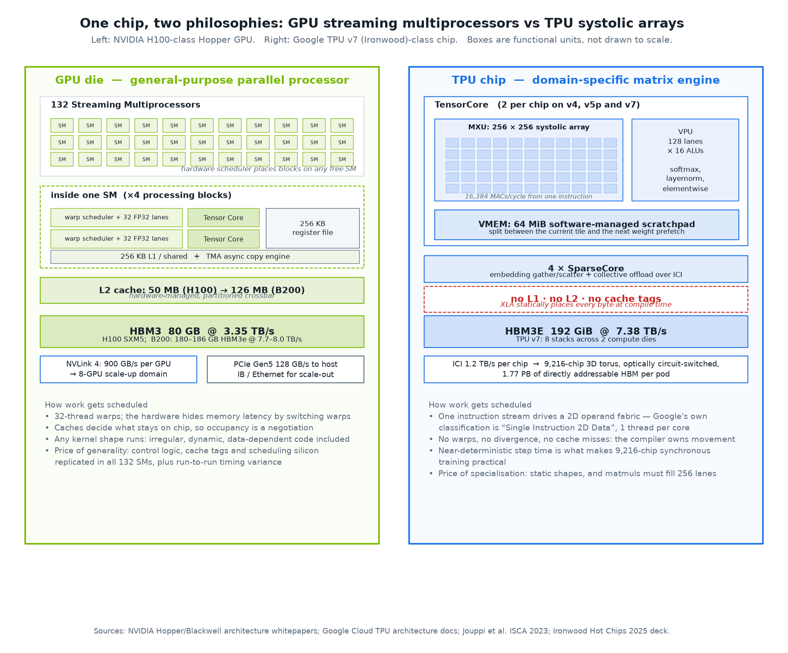

A datacenter GPU is a lattice of near-identical compute tiles wrapped in a memory system designed to keep them fed despite unpredictable access patterns. On an H100 there are 132 **streaming multiprocessors** (SMs); on a B200 there are 148 enabled across two dies; on Rubin, 224. Everything else — caches, schedulers, interconnect — exists to supply them.

### 1.1 Inside an SM

An SM is divided into four processing blocks, each with its own warp scheduler, dispatch unit, L0 instruction cache and slice of the register file. Per SM on Hopper: **128 FP32 lanes, 64 INT32, 64 FP64, four fourth-generation Tensor Cores, a 256 KB register file, and 256 KB of combined L1/shared memory** of which up to 228 KB can be configured as programmer-managed shared memory. (confirmed — Hopper whitepaper)

The execution model has been stable since Volta and is worth stating precisely, because it explains both the GPU's flexibility and its inefficiency: **32 threads per warp, up to 64 warps and 2,048 threads resident per SM, 32 thread blocks per SM, 65,536 32-bit registers per SM, 255 registers per thread.** Volta added independent thread scheduling, giving each thread its own program counter so divergent branches can interleave rather than serialise.

What changed generation to generation is not the model but the ratios and the units bolted on:

| | Volta V100 | Ampere A100 | Hopper H100 | Blackwell B200 |
|---|---|---|---|---|
| FP32 lanes per SM | 64 | 64 | **128** | 128 |
| Tensor Cores per SM | 8 (1st gen) | 4 (3rd gen) | 4 (4th gen) | 4 (5th gen) |
| Register file per SM | 256 KB | 256 KB | 256 KB | 256 KB |
| L1 + shared per SM | 128 KB | **192 KB** | **256 KB** | 256 KB |
| Max shared memory | 96 KB | 164 KB | 228 KB | not published |
| L2 total | 6 MB | **40 MB** | **50 MB** | **126 MB** (measured) |
| New numeric formats | FP16 tensor | TF32, BF16, 2:4 sparsity | **FP8 (E4M3/E5M2)** | **FP6, FP4, microscaling** |

(confirmed for Volta through Hopper from NVIDIA whitepapers; B200 L2 and SM count are independent measurements by Chips and Cheese — NVIDIA has stopped publishing SM and cache counts for datacenter Blackwell)

Note the ratio that got worse: registers per FP32 lane halved from 1,024 on A100 to 512 on H100, because the lanes doubled and the register file did not. This is one reason kernel authors moved from register-blocked GEMMs to shared-memory-and-TMA pipelines.

### 1.2 The three Hopper additions that made FP8 transformer training work

**Tensor Memory Accelerator (TMA).** A hardware unit that performs asynchronous multi-dimensional bulk copies between global and shared memory from a tensor descriptor. **A single thread** issues a copy of up to the full shared-memory capacity; the unit generates addresses and handles out-of-bounds behaviour while every other thread keeps computing. Synchronisation runs through shared-memory asynchronous transaction barriers rather than spinning. (confirmed)

Rubin extends this with **inline descriptor updates**: a kernel keeps one descriptor for tensors sharing a layout and overrides the base pointer and stride inside the TMA instruction itself. That is a direct attack on MoE inference, where hundreds of expert weight matrices share a layout but live at different addresses. (confirmed — NVIDIA Rubin architecture blog)

**Thread block clusters and distributed shared memory.** Hopper inserted a level between grid and thread block. A cluster co-schedules up to 16 blocks on SMs within one GPC, and **distributed shared memory** makes their shared-memory windows mutually addressable, so an SM can load, store and perform atomics directly on a neighbour's shared memory instead of round-tripping through global memory. (confirmed)

**The Transformer Engine.** First generation (Hopper): FP8 in two flavours — E4M3 forward, E5M2 for gradients — with per-tensor dynamic scaling driven by a tracked history of absolute-maximum values. Second generation (Blackwell): FP6 and FP4, and a move from per-tensor to **block (microscaling) formats**. Third generation (Rubin): a 3-bit lookup-table weight format for the B matrix, plus activation sparsity applied inside attention, where the intermediate scores are 2:4-compressed on the way out of Tensor Memory so softmax and the second GEMM operate on non-zeros while the output stays dense. (confirmed)

### 1.3 The cache hierarchy is the point of difference

L2 went 6 MB (V100) → 40 MB (A100) → 50 MB (H100) → 126 MB (B200). On B200 the L2 is partitioned, almost certainly one partition per die, with about 150 ns latency to the local partition and a cross-die penalty only slightly worse than A100's cross-partition penalty. A single B200 L2 partition holds more than an H100's entire L2. (estimate — measured by Chips and Cheese)

This is the architectural fork in the road. The GPU spends transistors on tags, coherence, replacement policy and residency controls so that **any** access pattern eventually performs acceptably. That is why a GPU runs a novel attention variant, a data-dependent MoE router, a graph neural network and a physics kernel with the same silicon. It is also why a GPU has more silicon per delivered MAC than a systolic machine, and why its step times vary.

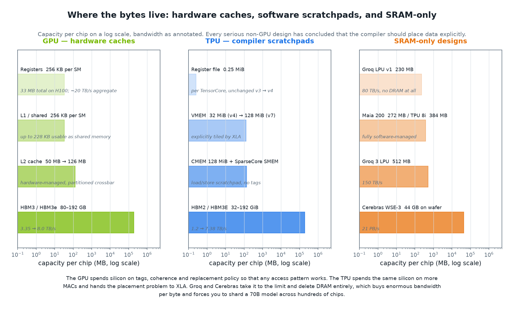

### 1.4 Scaling out: NVLink, NVSwitch and the 8-GPU wall

A GPU alone cannot hold a frontier model, so the interconnect is part of the architecture, not an accessory.

| NVLink generation | GPUs | Per-GPU bidirectional bandwidth |
|---|---|---|
| NVLink 2 | V100 | 300 GB/s (6 links) |
| NVLink 3 | A100 | 600 GB/s (12 links) |
| NVLink 4 | H100, H200, GH200 | 900 GB/s (18 links) |
| NVLink 5 | B100, B200, B300 | **1,800 GB/s** (18 × 100 GB/s) |
| NVLink 6 | Rubin | **3,600 GB/s** |

(confirmed — NVIDIA datasheets and the GB200 NVL72 technical blog)

Separately, **NVLink-C2C** connects a Grace CPU to its GPU coherently at 900 GB/s on GH200 (1.3 pJ/bit, over 5× more energy-efficient per bit than PCIe Gen5), rising to 1,800 GB/s on Vera Rubin. That is what lets a GPU issue loads and stores against 480 GB of CPU LPDDR5X as if it were a slower tier of its own memory.

For a decade the practical consequence was the **8-GPU wall**: NVSwitch lived on the server baseboard, so the coherent domain was one node. Tensor parallelism, which all-reduces the full activation tensor four times per transformer layer, had to fit inside it. Above 8 GPUs you were on InfiniBand at roughly 50 GB/s per GPU — about 18× less bandwidth.

**GB200 NVL72 moved the switches into the rack** and broke that wall. 72 GPUs, 36 Grace CPUs, 18 compute trays, 9 switch trays holding 18 NVSwitch ASICs. Each GPU has exactly 18 NVLink 5 ports, one to each ASIC, over a copper backplane: fully connected, non-blocking, no topology-dependent hot spots, 130 TB/s of aggregate all-to-all bandwidth. The switch also does in-network reduction (SHARP), cutting both latency and bytes on the wire for all-reduce. (confirmed)

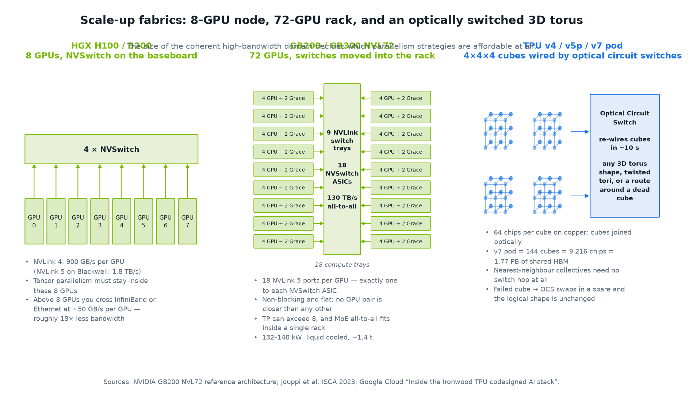

NVIDIA quantifies the payoff bluntly: "every 2× of scale-up in NVLink bandwidth can lead to 1.3–1.4× of rack-level AI performance improvement." Vera Rubin NVL72 keeps 72 packages and doubles the fabric to 260 TB/s.

Scale-out has moved in parallel: Quantum-X800 InfiniBand at 800 Gb/s per port with 144-port switches (115.2 Tb/s), the first use of 200 Gb/s-per-lane SerDes, SHARPv4 with 14.4 TFLOPS of in-network compute, and co-packaged-optics variants that cut insertion loss from about 22 dB to 4 dB. Notably, the fastest MLPerf v6.0 result at 8,192 GPUs ran on **Spectrum-X Ethernet**, not InfiniBand — evidence that Ethernet is now viable at frontier scale. (confirmed)

---

## 2. How a TPU works

A TPU starts from the observation that transformer training is overwhelmingly matrix multiplication, and asks what you would build if you were allowed to give up generality.

### 2.1 The systolic array

A systolic array is a two-dimensional grid of multiply-accumulate cells wired directly to their neighbours. Google's own description: "TPUs contain thousands of multiply-accumulators that are directly connected to each other to form a large physical matrix." Operands enter at the edges and *pulse* through — each cell takes values from its neighbours, multiplies, accumulates, and passes results onward. Nothing returns to a register file or cache in between.

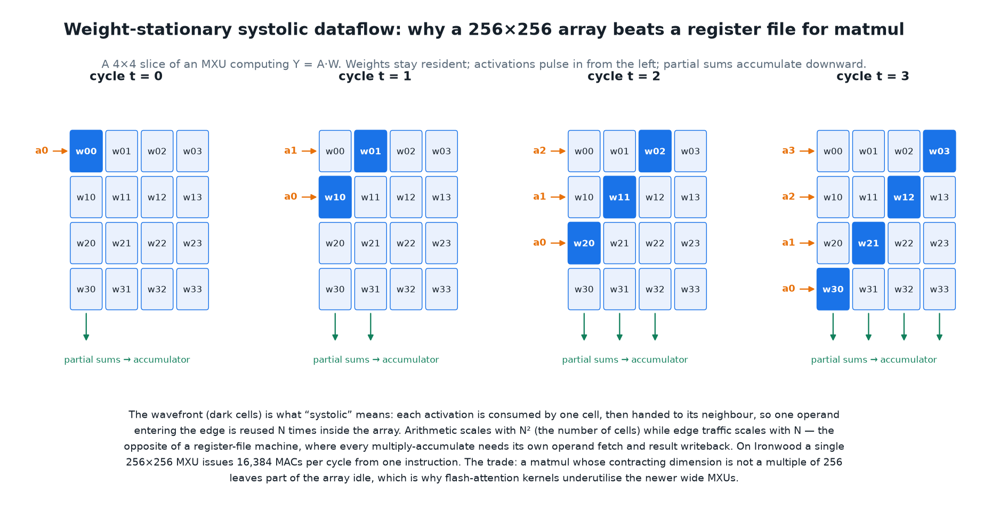

The reason this fits matmul is an arithmetic-intensity argument. In an N×N array, an operand entering the edge is reused N times as it propagates, so **arithmetic scales with N² (the cell count) while traffic across the array boundary scales with N**. A 256×256 Ironwood MXU performs **16,384 MACs per cycle** from one instruction. A conventional machine needs an operand fetch and a result writeback per MAC; the systolic array replaces that O(N²) register traffic with O(N) edge traffic plus nearest-neighbour wires, and short local wires are dramatically cheaper in energy than SRAM accesses.

Google TPUs are fundamentally **weight-stationary**: a tile of the weight matrix stays resident while activations stream through. TPU v4 explicitly improved "faster MXU weight loading bandwidth" to cut the changeover cost, and Ironwood exposes the pipeline to the programmer — VMEM is split between the current computation scope and the *next* weight prefetch, tuned with `xla_tpu_scoped_vmem_limit_kib`. (confirmed)

The array width is not free. Google states that Ironwood's MXU "is efficient when the contracting dimension is larger than or equal to a multiple of 256." The move from 128×128 (v2 through v5p) to 256×256 (v6e, v7) raised peak FLOPS and simultaneously raised the granularity you must hit to achieve them — Google notes flash-attention kernels suffer "more underutilization of the MXU" as a result. A matmul with a contracting dimension of 128 wastes half the array.

### 2.2 No caches, anywhere

There is no cache hierarchy on a TPU. Every level of on-chip memory is a software-managed scratchpad with an explicit address space, and XLA decides statically what lives where and when it moves. No prefetcher, no eviction policy, no coherence protocol, no cache tags.

| Scratchpad | Role | Sizes |
|---|---|---|
| **VMEM** | High-bandwidth staging for MXU/VPU; the tile buffer for custom kernels | v3: 32 MiB · v4: 16 MiB per TensorCore (32/chip) · **v7: 64 MiB per TensorCore (128/chip)** · TPU 8i: 384 MB |
| **CMEM** | Chip-level scratchpad shared by both TensorCores, load/store access. New in v4 | v4: **128 MiB** |
| **SMEM / Spmem** | Per-SparseCore-tile buffer for embedding vectors | v3: 5 MiB · v4: 10 MiB (2.5 MiB per tile slice) |
| Register file | | 0.25 MiB, unchanged v3 → v4 |

(confirmed — Jouppi et al. ISCA 2023; Google Cloud Ironwood performance docs)

CMEM was measurably load-bearing rather than decorative. The v4 paper reports RNN1 — small weights, small batches — running **3.3× faster on v4 than v3**, well above the typical 1.5–2.0×, and attributes it specifically to "CMEM bandwidth versus HBM." The v4i paper decomposes its performance-per-watt gain as roughly 1.5× from CMEM, 1.3× from the 16nm→7nm move, and 1.2× from everything else.

**Why determinism is the real product.** Because the compiler knows when every byte arrives, XLA can statically schedule collectives to overlap maximally with compute. Google's Gemini technical report describes exactly this: the GSPMD partitioner partitions the step, and "the MegaScale XLA compiler pass statically schedules appropriate collectives so that they maximally overlap with the computation **with very little variation in step time**." At 4,096-chip synchronous scale the slowest chip sets the pace, so removing variance is worth more than raising the mean.

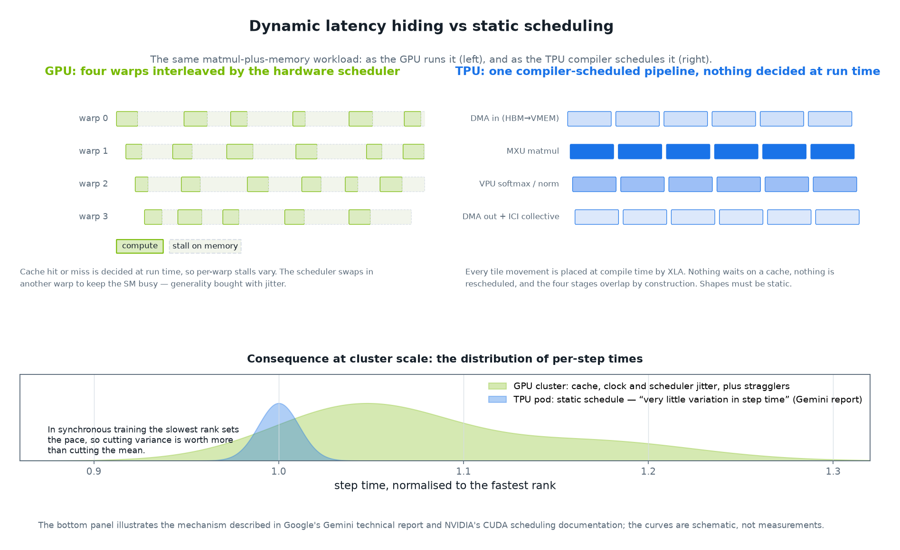

The cost is that everything becomes the compiler's problem. Shapes must be static or padded to static buckets. A kernel whose working set overflows VMEM does not degrade gracefully; it gets a different, worse schedule. And when performance is bad you are debugging XLA's choices, which are far less legible than a GPU profiler trace.

### 2.3 SparseCore: the part that is not a systolic array

Embedding lookups — irregular, data-dependent gather/scatter — are what a systolic array is worst at. Rather than compromise the MXU, Google added a separate dataflow processor on the same die.

The economics are remarkable, and Google states them plainly: SparseCores "speed up models that rely on embeddings by **5×–7× yet use only 5% of die area and power**." Each SparseCore tile has a Fetch Unit pulling activations and parameters from HBM into its 2.5 MiB Spmem slice, an scVPU reusing the TensorCore's ALUs, a Flush Unit writing updated parameters back on the backward pass, and five Cross-Channel Units executing embedding primitives across all 16 banks. These units run **CISC-like instructions on variable-length inputs where each instruction's runtime is data-dependent** — deliberately the opposite of the MXU's deterministic pipeline, isolated on its own core so the irregularity cannot infect the main datapath. (confirmed — ISCA 2023)

SparseCores also give the pod a flat, globally addressable memory space — **128 TiB on TPU v4** — which is how an embedding table larger than any chip's HBM gets sharded across a pod and accessed over ICI.

In Ironwood, SparseCore acquired a second job: **collective offloading**. The SparseCores are now "independent threads of control capable of managing data movement over the ICI fabric," so All-Gather and Reduce-Scatter run in parallel with TensorCore compute. Google calls it "the recommended method for asynchronous collectives on TPU7x." (confirmed)

### 2.4 The optically reconfigurable torus

From v4 onward a pod is not hard-wired. Chips are grouped into **4×4×4 cubes of 64 chips** on passive copper, and the cubes are joined through **optical circuit switches** — mechanically steered mirror arrays that make a physical-layer optical circuit between fibre ports. Four consequences follow, and all four are load-bearing.

**Topology on demand.** Gemini's technical report gives the timescale: v4 superpods of 4,096 chips are "each connected to a dedicated optical switch, which can dynamically reconfigure 4×4×4 chip cubes into arbitrary 3D torus topologies in around 10 seconds." A 512-chip slice can be 4×4×32, 4×8×16 or 8×8×8 depending on which parallelism dimensions your model wants, and Google's docs advise matching them.

**Twisted tori.** Because links are switch-mediated, wrap-around edges can shift by X+2 mod 4 instead of connecting same-coordinate chips, converting an asymmetric torus into a symmetric one. Published bisection-bandwidth gains: about **70% for 4×4×8, 8×8×16 and 12×12×24**, about 40% for 4×8×8 and 8×16×16. Measured effect on FSDP MaxText was 1–2 percentage points of MFU. (confirmed)

**Fault tolerance and scheduling availability.** Google calls this ICI resiliency: connections route around OCS and optical faults, which "improves the scheduling availability of TPU slices, with the trade-off of temporary degradation in ICI performance," and it is on by default for slices of one cube or larger. The v4 paper's argument is that with hosts at 99.0–99.9% availability, "in practice it is much easier to schedule a 3K slice than a 4K" one. Gemini Ultra exploited this explicitly: "we decided to retain a small number of cubes per superpod to allow for hot standbys and rolling maintenance."

**Pod-scale memory sharing.** Ironwood's Hot Chips deck frames OCS as a memory technology: 9,216 chips "use optical circuit switches to share memory… directly addressable shared HBM memory capacity of **1.77 PB**."

### 2.5 What this buys, in one number

A TPU v7 chip delivers 2,307 dense BF16 TFLOP/s and 4,614 FP8 TFLOP/s with 192 GiB of HBM3E at 7.38 TB/s, and a 9,216-chip superpod reaches 42.5 FP8 exaFLOPS inside about 10 MW. Google claims 2× the performance per watt of Trillium and roughly 30× that of its 2018 Cloud TPU. (confirmed for specs; the perf/W comparisons are vendor claims with no independent benchmark)

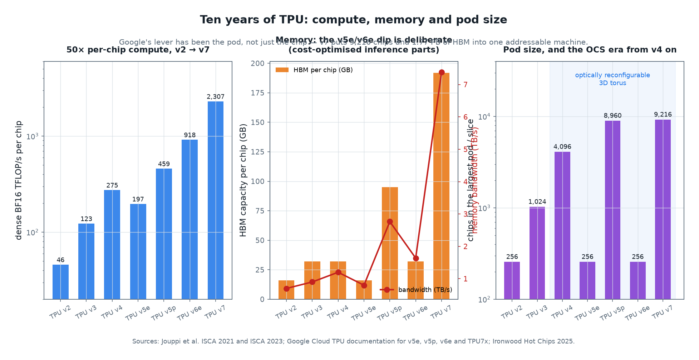

---

## 3. The differences that matter

Six differences do real work. The rest is marketing.

### 3.1 Who decides where the data goes

| | GPU | TPU |
|---|---|---|
| On-chip memory | Hardware caches (L1/L2) with residency hints | Software scratchpads (VMEM, CMEM, SMEM) |
| Latency hiding | Dynamic: swap warps on a miss | Static: compiler-placed DMA pipeline |
| Instruction model | SIMT, 32-thread warps, up to 2,048 threads/SM | "Single Instruction 2D Data", 1 thread per core |
| Step-time variance | Meaningful — caches, clocks, scheduler | Very small by construction |
| Irregular workloads | Runs them, at some efficiency | Needs a separate unit (SparseCore) or fails |
| Who you debug | Your kernel, with a profiler | The compiler's schedule, with less visibility |

This single distinction explains most downstream differences, including why TPUs achieve better MACs per watt and why porting an exotic research kernel to a TPU is harder than porting it to AMD.

### 3.2 Array granularity

A GPU Tensor Core instruction operates on a small tile (order 16×8×16) and is re-issued thousands of times by warps, with register reads, scheduling and dispatch amortised over relatively few MACs. A TPU MXU is one 256×256 physical fabric issuing 16,384 MACs per cycle from one instruction. The GPU wins on any matmul that does not fill 256 lanes in the contracting dimension; the TPU wins on the large regular GEMMs that dominate transformer training.

### 3.3 The scale-up domain

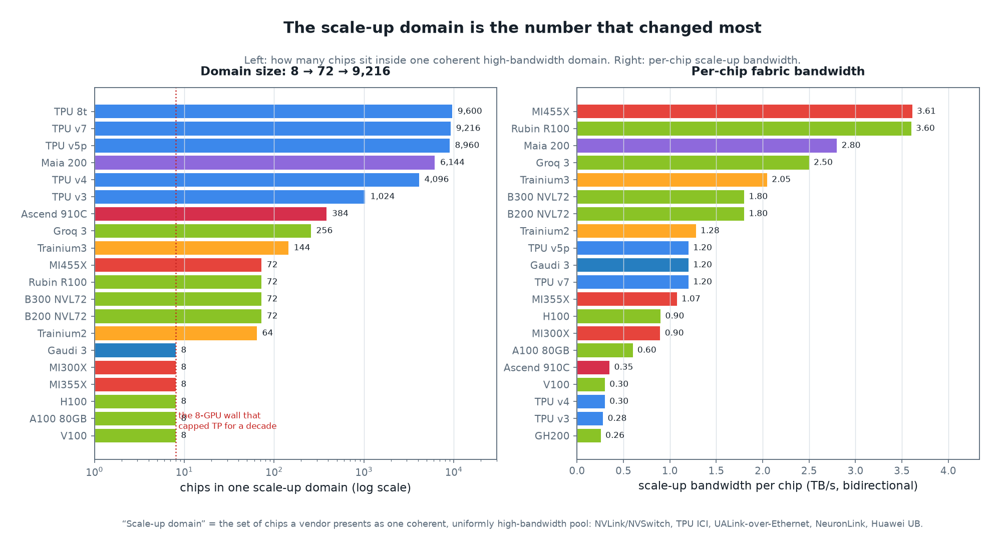

This is the number that changed most, and it is the one most often left out of chip-versus-chip comparisons.

| System | Chips in one coherent domain | Per-chip fabric |
|---|---|---|
| HGX H100 / H200 | 8 | 900 GB/s NVLink 4 |
| HGX B200 | 8 | 1.8 TB/s NVLink 5 |
| GB200 / GB300 NVL72 | **72** | 1.8 TB/s NVLink 5 |
| Vera Rubin NVL72 | 72 | **3.6 TB/s NVLink 6** |
| AMD Helios (MI455X) | **72** | 3.6 TB/s UALink-over-Ethernet |
| Trainium3 Gen2 UltraServer | 144 | 2.0 TB/s NeuronLink v4 |
| Huawei CloudMatrix 384 | 384 | 350 GB/s Unified Bus |
| Microsoft Maia 200 | 6,144 | 2.8 TB/s Ethernet + custom transport |
| TPU v7 Ironwood pod | **9,216** | 1.2 TB/s ICI (3D torus + OCS) |
| TPU 8t pod | 9,600 | not published |

(confirmed from vendor documentation; see `data/accelerators.csv`)

Google's advantage here is structural and hard to copy: **nobody else has a reconfigurable topology.** OCS gives topology matching, twisted tori, fault isolation and scheduling flexibility that fixed copper cannot. NVIDIA's answer is raw bandwidth and a flat non-blocking 72-GPU domain; AMD's is the same domain size over open standards; Microsoft, Intel and AMD have all independently chosen Ethernet for scale-up specifically to avoid proprietary lock-in.

Note also what the eighth-generation TPU split tells you about workload divergence. TPU 8t keeps a 3D torus at 9,600 chips because neighbour traffic dominates dense pretraining. TPU 8i abandons it for a high-radix "Boardfly" fabric because all-to-all dominates MoE and reasoning, and Google published the arithmetic: an 8×8×16 torus of 1,024 chips has a 16-hop diameter, where Boardfly reaches the same 1,024 chips in **7 hops**. (confirmed)

### 3.4 Precision

Both families are converging on the same formats, and the interesting differences are in the metadata rather than the element width.

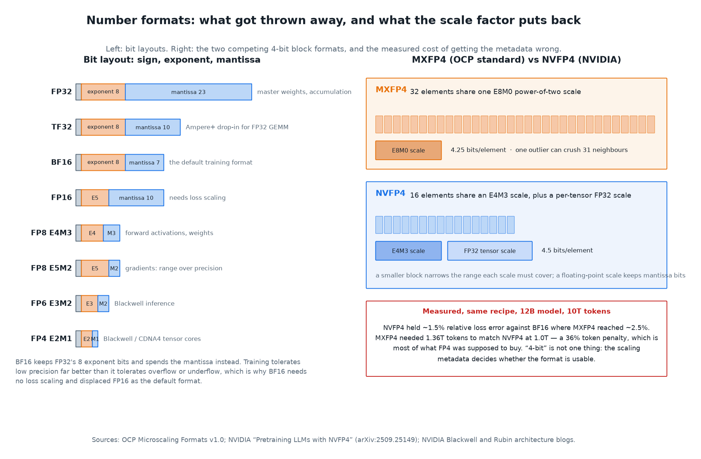

| Format | GPU support | TPU support |
|---|---|---|
| BF16 | Ampere onward | v2 onward (native MXU input, FP32 accumulate) |
| FP8 | Hopper onward (Transformer Engine) | v5p onward |
| FP6 / FP4 | Blackwell onward (MXFP, NVFP4) | **TPU 8t/8i: native FP4 in the MXU** |
| INT8 | all generations | v1 onward; v4 at full rate |
| 3-bit LUT weights | Rubin | not announced |

The measured result that should govern any FP4 planning: with an identical recipe on a 12B model, **NVFP4 held about 1.5% relative loss error against BF16 where OCP MXFP4 reached about 2.5%, and MXFP4 needed 36% more tokens (1.36T vs 1.0T) to match NVFP4's loss.** A 36% token penalty is most of what 4-bit was supposed to buy. The cause is exactly the metadata: 16-element blocks with an E4M3 scale plus a per-tensor FP32 scale preserve more local dynamic range than 32-element blocks with a power-of-two E8M0 scale. (confirmed — NVIDIA, arXiv:2509.25149)

### 3.5 Availability and lock-in

| | GPU (NVIDIA/AMD) | TPU |
|---|---|---|
| Can you buy the silicon? | Yes, from many OEMs | **No** |
| Where can you rent it? | Every hyperscaler, dozens of neoclouds, marketplaces | Google Cloud only |
| Price discovery | Real, and volatile (45× spread on H100) | Google's list price, or a negotiated contract |
| Exit cost if prices rise | Move providers | Renegotiate, or port the model |
| On-prem | Normal | Google Distributed Cloud only |

This is not a footnote. SemiAnalysis's TPU-versus-GPU total-cost model concludes Google's internal TCO per Ironwood chip is roughly 44% below a GB200 server, and that an external GCP customer sees roughly 30–41% lower cost per hour than GB200/GB300. But that first number is a cost-of-goods figure computed by the only company that both designs the chip and runs the datacenter. You are not that company. You rent at a price Google sets, and unlike a GPU you cannot buy the silicon and run it elsewhere. The actionable question is not "is a TPU cheaper than a GPU" but "is this GCP commitment cheaper than my GPU alternative" — a procurement negotiation, not a benchmark. (estimate)

One striking data point on the negotiating value of the *threat*: SemiAnalysis reports that "OpenAI hasn't even deployed TPUs yet and they've already saved ~30% on their entire lab-wide NVIDIA fleet." (estimate)

### 3.6 Software

| | GPU | TPU |
|---|---|---|
| Kernel authoring | CUDA C++, CUTLASS/CuTe, Triton, hand-written PTX | Pallas (Python DSL); otherwise you rely on XLA |
| Distribution | Explicit: NCCL calls, Megatron/DeepSpeed/FSDP configuration | Declarative: annotate arrays, GSPMD inserts collectives |
| Numerics library | TransformerEngine ships with the silicon | XLA built-in |
| Reference training stack | Megatron-LM / NeMo | MaxText (JAX) |
| Orchestration | Multi-controller, one process per device | Pathways single-controller across pods |
| New research techniques | Land here first, usually by months | Follow |
| Failure mode | A slow kernel you can profile | A recompilation or a schedule you cannot see |

The honest summary of the CUDA moat in 2026: it has narrowed to the frontier. For a well-trodden dense or MoE transformer, alternatives work — Gemini is trained entirely on TPUs, Zyphra pretrained ZAYA1 on 1,024 MI300X with ROCm 6.4 and RCCL over AMD Pollara Ethernet, and AMD's MI355X posted 10.18 minutes on MLPerf Llama 2 70B LoRA against NVIDIA's 11.145-minute GB200 result from the prior round. What CUDA still owns is *breadth*: NVIDIA was the only vendor to submit across all seven MLPerf Training v6.0 workloads, and every new numeric format arrives with day-one library support. Triton is the most important counterweight, because kernels written in Triton compile to AMD backends and increasingly to others, so the share of the ecosystem that is hard-locked to CUDA keeps shrinking.

---

## 4. The arithmetic of LLM training on real hardware

This section is the bridge between the specifications and the invoices. Every constant here is checkable, and the worked examples reconcile against published runs.

### 4.1 The 6ND rule

Training FLOPs ≈ **6 × parameters × tokens**. The forward pass costs 2 FLOPs per parameter per token (one multiply, one add); the backward pass costs twice that, because each layer computes both a weight gradient and an input gradient. Kaplan et al. (2020) drop the attention-score term `2·n_layer·n_ctx·d_attn`, which was two orders of magnitude smaller for the models of that era — and is *not* negligible at 128k context, which is precisely why Meta's measured throughput fell from 400 to 380 TFLOP/s per GPU during Llama 3.1's long-context stage.

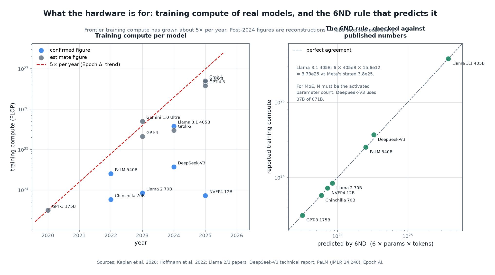

**Chinchilla-optimal allocation** is about 20 tokens per parameter. Substituting D = 20N into C = 6ND gives C = 120N², so N_opt = √(C/120). Chinchilla itself: 70B parameters on 1.4T tokens beat the 280B Gopher at equal compute. (confirmed — Hoffmann et al. 2022)

Nobody trains at the Chinchilla point any more, because inference cost scales with N and is paid forever. Llama 3.1 405B used about 38 tokens per parameter; Llama 3.1 8B used roughly 1,875, about 90× "over-trained."

**Worked check on Llama 3.1 405B.** 6 × 405e9 × 15.6e12 = **3.79e25 FLOP** against Meta's stated 3.8e25. Now against GPU-hours: 30.84M H100-hours × 3,600 s × 989.5e12 dense BF16 FLOP/s = 1.10e26 FLOP of peak capacity, so **end-to-end utilisation was 34.6%** while Meta reports 38–43% instantaneous MFU. The ~16% gap is restarts, evaluation, checkpoint stalls and the lower-MFU long-context stage. That reconciliation is the most honest single picture of what a frontier training run looks like. (estimate, from confirmed inputs)

**Worked check on DeepSeek-V3.** Using activated parameters: 6 × 37e9 × 14.8e12 = 3.29e24. DeepSeek's own hardware paper states 250 GFLOPS per token, giving 3.70e24 — the gap is MLA attention and routing that 6ND omits. Against 2.664M H800-hours the run used about 39% of BF16 peak, but its GEMMs ran in FP8, so **19.5% of FP8 peak**. The famous $5.576M figure is therefore evidence of a very sparse model on cheap-per-hour silicon, not of unusual hardware efficiency — and DeepSeek says explicitly it excludes "prior research and ablation experiments." (confirmed inputs, derived ratios)

### 4.2 Memory: why one accelerator is never enough

Mixed-precision Adam costs **16 bytes per parameter**: 2 (BF16 weights) + 2 (BF16 gradients) + 4 (FP32 master weights) + 4 (Adam m) + 4 (Adam v).

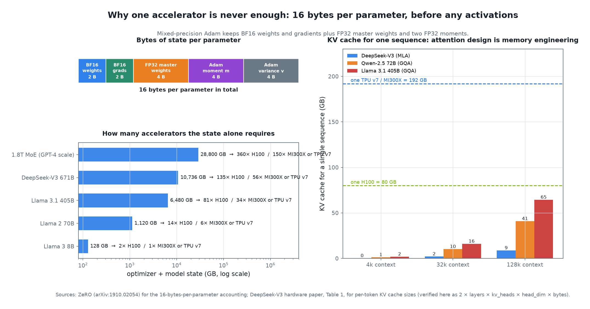

ZeRO/FSDP shards those three categories across the data-parallel degree:

| Stage | What is sharded | Per-GPU bytes | 7.5B model, 64-way |
|---|---|---|---|
| DDP baseline | nothing | 16Ψ | 120 GB |
| ZeRO-1 | optimizer states | 4Ψ + 12Ψ/N | 31.4 GB |
| ZeRO-2 | + gradients | 2Ψ + 14Ψ/N | 16.6 GB |
| ZeRO-3 / FSDP | + parameters | 16Ψ/N | 1.9 GB |

(confirmed — ZeRO, arXiv:1910.02054)

**Activation memory** per transformer layer without recomputation is `s·b·h·(34 + 5·a·s/h)` bytes in BF16. The `5as/h` term is the attention score matrix, quadratic in sequence length — exactly the term FlashAttention removes from HBM.

**KV cache per token** = `2 × n_layer × n_kv_heads × d_head × bytes`. Verifying against Llama 3.1 405B (126 layers, 8 GQA KV heads, head dim 128, BF16): 2 × 126 × 8 × 128 × 2 = **516,096 bytes = 516 KB per token**, matching DeepSeek's published table exactly. At that rate a single 128k-token context needs **66 GB** — most of an H100 — for one sequence. DeepSeek's MLA gets the same job done in 70.3 KB per token, 7.3× less.

The structural problem, as DeepSeek frames it citing the AI-memory-wall literature: **LLM memory demand grows more than 1000% per year while HBM capacity grows less than 50% per year.**

### 4.3 Roofline: the ~300 FLOP/byte wall

Arithmetic intensity is FLOPs per byte moved from HBM. A kernel is compute-bound above the machine's ridge point (peak ÷ bandwidth).

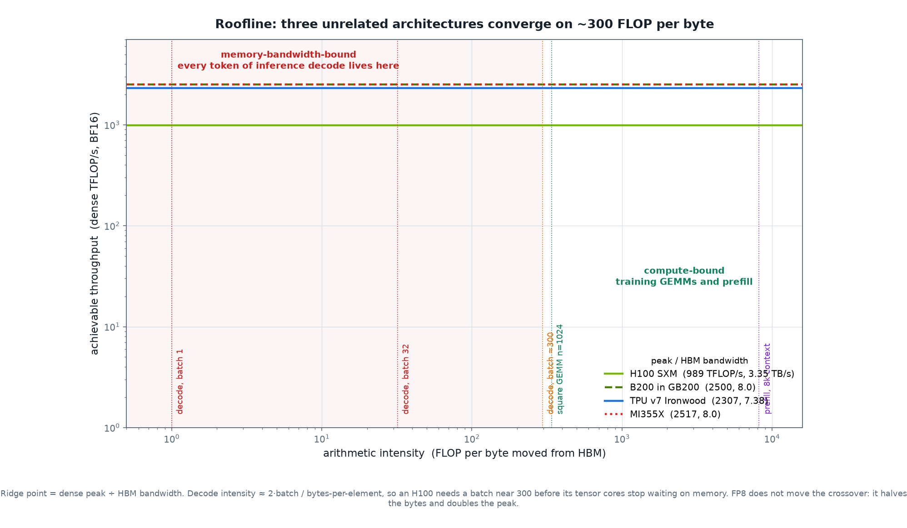

| Accelerator | Dense BF16 peak | HBM bandwidth | Ridge point |
|---|---|---|---|
| H100 SXM | 989.5 TFLOP/s | 3.35 TB/s | **295 FLOP/byte** |
| B200 (in GB200) | ~2,500 TFLOP/s | 8.0 TB/s | **~312** |
| TPU v7 Ironwood | 2,307 TFLOP/s | 7.38 TB/s | **~313** |
| MI355X | 2,517 TFLOP/s | 8.0 TB/s | **~315** |
| TPU v6e Trillium | 918 TFLOP/s | 1.638 TB/s | 561 |

The convergence around 300 across four unrelated architectures is not coincidence — it reflects the shared economics of HBM stacks against logic area. Practical consequences:

- A square BF16 GEMM has intensity n/3, so **n ≳ 900** to clear the ridge. Tiny GEMMs — small batch, heavily sharded tensor-parallel slices — waste the machine.
- **Prefill** at 8k context has intensity ~8,192: firmly compute-bound.
- **Decode** has intensity ≈ batch size. To clear 295 on an H100 you need a batch near 300. Below that you pay full HBM traffic for the entire weight matrix to produce one token per sequence. This is why inference economics are a batching and KV-cache problem, and why "decode MFU" of 8–12% at batch 32 is not bad engineering but a roofline ceiling.
- **FP8 does not move the crossover.** It halves the bytes and doubles the peak, so the ridge point doubles too. FP8 raises throughput, it does not make decode compute-bound.

**FlashAttention** is the single most important software change to this picture: it tiles attention so the S×S score matrix never leaves SRAM, cutting HBM accesses by a factor of roughly SRAM-size ÷ head-dim². FlashAttention-3 reaches 740–840 TFLOP/s on an H100 (75–85% of dense BF16 peak) versus about 35% for FA-2, and its FP8 variant hits 1.2–1.3 PFLOP/s with 2.6× lower numerical error than baseline per-tensor FP8 attention. (confirmed)

### 4.4 Parallelism, and why the fabric decides the strategy

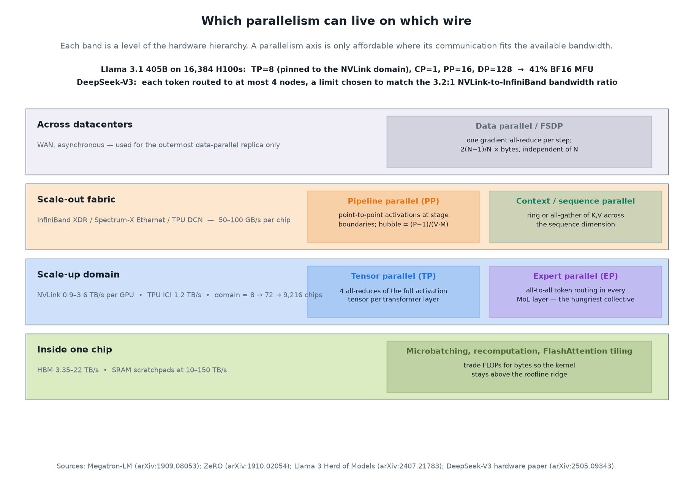

| Axis | What is split | Communication per step | Where it can live |
|---|---|---|---|
| Data parallel / FSDP | batch (+ state) | one gradient all-reduce; ring moves 2(N−1)/N × bytes | scale-out, even WAN |
| Tensor parallel | individual weight matrices | **4 all-reduces of the full activation per layer** | scale-up only |
| Expert parallel | MoE experts | all-to-all token routing per MoE layer | scale-up, spilling out |
| Pipeline parallel | layers | point-to-point at stage boundaries; bubble = (P−1)/(V·M) | scale-out |
| Context/sequence parallel | sequence | ring or all-gather of K,V | scale-up preferred |

**Worked example — why TP must stay inside NVLink.** Llama 3.1 405B's real configuration: h = 16,384, s = 8,192, microbatch 1, BF16, TP = 8. The activation tensor is 8,192 × 16,384 × 2 = 268 MB. Ring all-reduce puts 2×7/8 × 268 MB = 470 MB on the wire per GPU, four times per layer, so **1.88 GB per GPU per layer per microbatch**. That layer's compute at Meta's measured 400 TFLOP/s takes about 49.5 ms per GPU.

| Fabric | Per-GPU unidirectional | Communication time | As % of compute |
|---|---|---|---|
| NVLink 4 (H100) | 450 GB/s | 4.2 ms | **8.5%** |
| NVLink 5 (GB200 NVL72) | 900 GB/s | 2.1 ms | **4.2%** |
| InfiniBand NDR 400G | 50 GB/s | 37.6 ms | **76%** |

(estimate, derived from confirmed specs)

That last row is the entire argument for rack-scale systems. It is also why DeepSeek capped each token's routing to at most 4 nodes — a model-architecture decision made backwards from the ~3.2:1 ratio between intra-node NVLink and inter-node InfiniBand bandwidth.

**Meta's published parallelism table** is the best public ground truth on how the axes compose:

| GPUs | TP | CP | PP | DP | Seq len | TFLOP/s per GPU | BF16 MFU |
|---|---|---|---|---|---|---|---|
| 8,192 | 8 | 1 | 16 | 64 | 8,192 | 430 | **43%** |
| 16,384 | 8 | 1 | 16 | 128 | 8,192 | 400 | **41%** |
| 16,384 | 8 | 16 | 16 | 8 | 131,072 | 380 | **38%** |

(confirmed — Llama 3 paper, Table 4)

Read the pattern: TP is pinned at 8 (the NVLink domain), PP at 16 (cheap over RoCE), and doubling the GPU count halves the per-replica batch, which shrinks the GEMMs and costs 2 points of MFU. Extending context to 128k consumes 16-way context parallelism taken out of data parallelism and costs 3 more.

**What NVL72 changes.** Megatron Core's TP-communication overlap "requires all devices to be on the same NVLink fabric, which on NVIDIA Hopper systems mean a maximum of 8 GPU servers can be utilized for a single parallelism group. NVIDIA GB200 NVL72 alleviates this limitation." TP can exceed 8, which shrinks pipeline depth and the bubble; MoE all-to-all can be confined to one rack; and in NVL72 there is no intra-tray GPU-to-GPU shortcut at all — all 72 GPUs are equidistant, so the placement heuristics developed for 8-GPU nodes stop applying. (confirmed)

### 4.5 What MFU you should actually expect

| Regime | Typical MFU (dense peak denominator) |
|---|---|
| Dense transformer pretraining, BF16, well tuned | 40–55% |
| MoE pretraining | 25–40% (routing fragments compute; load imbalance) |
| Fine-tuning with adequate batch | 35–50% |
| Inference prefill | 30–50% |
| **Inference decode, batch 32** | **8–12% — and that is well-optimised** |
| Naive eager PyTorch, no fusion | 3–8% |

Published first-party figures: Meta 38–43% (Llama 3.1 405B), Google 46.2% (PaLM), NVIDIA Megatron-LM up to 47%, Databricks over 50% on 64 H100s. (confirmed)

One trap worth naming: **FP8 runs report lower MFU while being faster**, because the FP8 peak is 2× the BF16 peak. Databricks measured a 1.4–1.5× throughput gain from FP8 alongside a *lower* MFU percentage. Any MFU comparison without a stated, common, dense denominator is meaningless.

### 4.6 Reliability is a hardware specification

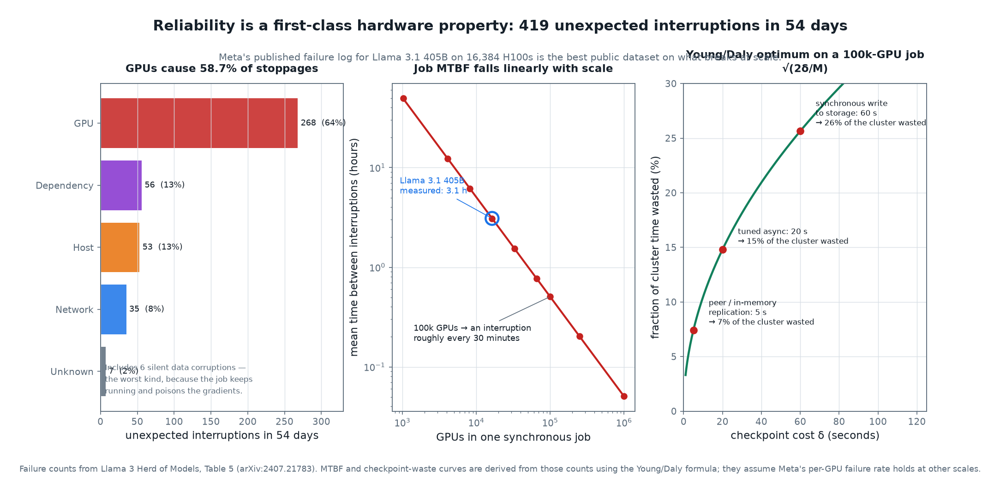

Meta's published failure log for Llama 3.1 405B on 16,384 H100s over 54 days is the best public dataset in existence on what breaks at scale: **466 interruptions, 47 planned and 419 unexpected, of which about 78% were confirmed hardware issues.** Meta states that GPU issues are the largest single category at **58.7% of unexpected interruptions**; tabulating the paper's per-cause counts (148 faulty GPUs, 72 HBM3 failures, 19 SRAM, 17 GPU system processors, 6 thermal-interface or sensor faults, 6 silent data corruptions) gives 268 of 419, or 64% — the difference depends on whether SRAM, thermal and silent-corruption events are attributed to the GPU. Software bugs were third at 54 events. Only **3 of 419** interruptions needed significant human intervention, and Meta still achieved over 90% effective training time. (confirmed — Llama 3 paper, Table 5)

Derived consequences (estimate, assuming Meta's per-GPU rate holds):

- Per-GPU MTBF ≈ 2,112 GPU-days ≈ 5.8 GPU-years counting all causes.
- Job MTBF = per-GPU MTBF ÷ N: **3.1 hours at 16,384 GPUs, about 30 minutes at 100,000, about 3 minutes at a million.**
- Young/Daly optimum: waste ≈ √(2δ/M). On a 100k-GPU job, a 60-second synchronous checkpoint wastes **26% of the cluster**; 5-second peer/in-memory replication wastes 7%.

That arithmetic is why checkpointing engineering outranks kernel micro-optimisation at scale. Meta's Tectonic storage fabric — 240 PB across 7,500 SSD servers, 2 TB/s sustained — exists to absorb "highly bursty checkpoint writes." Google's answer for Gemini was different and more radical: **redundant in-memory copies of model state instead of periodic checkpointing to storage, lifting goodput from 85% to 97%.** Google also notes that at Gemini scale silent data corruption "impact[s] training every week or two."

Two further failure modes worth knowing. First, hardware failures at this scale often present as **hangs, not errors**: Meta notes that NVLink load/store failures "often manifest as stalled load/store operations within CUDA kernels without returning a clear error code," which is why the NCCL flight recorder exists. Second, synchronous training makes the whole cluster one coherent electrical load — tens of thousands of GPUs pausing together for a checkpoint produce "instant fluctuations of power consumption across the data center on the order of tens of megawatts, stretching the limits of the power grid."

TPUs attack the same problem at the topology layer: a failed cube is optically bypassed and a spare swapped in, so the job resumes on a *logically identical* mesh — which matters enormously in a compiler-first stack where the mesh shape is baked into the compiled program.

---

## 5. The NVIDIA lineup

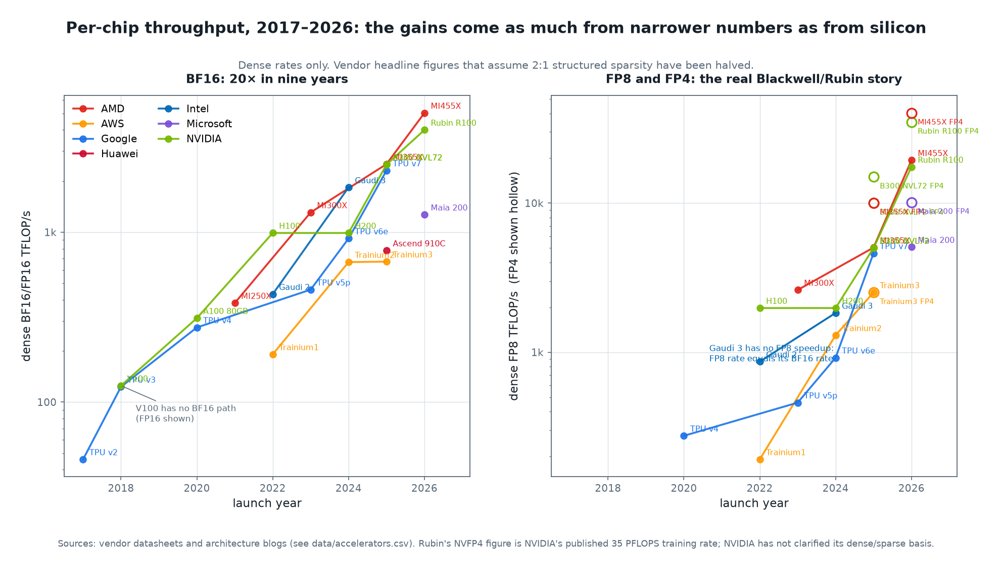

### 5.1 Datacenter training and inference parts

| Accelerator | Launch | Process | Memory | BW (TB/s) | BF16 dense | FP8 dense | FP4 dense | TDP | Scale-up | Domain | Unit price |
| --- | --- | --- | --- | --- | --- | --- | --- | --- | --- | --- | --- |
| **Tesla V100 SXM2 32GB** | 2018-Q2 | TSMC 12FFN | 32 GB HBM2 | 0.90 | 125 TF | — | — | 300 W | 300 GB/s | 8 | eol |
| **A100 SXM4 40GB** | 2020-Q2 | TSMC N7 | 40 GB HBM2 | 1.55 | 312 TF | — | — | 400 W | 600 GB/s | 8 | $12,000 (estimate) |
| **A100 SXM4 80GB** | 2020-Q4 | TSMC N7 | 80 GB HBM2e | 2.04 | 312 TF | — | — | 400 W | 600 GB/s | 8 | $12,500 (estimate) |
| **H100 SXM5 80GB** | 2022-Q3 | TSMC 4N | 80 GB HBM3 | 3.35 | 990 TF | 1,979 TF | — | 700 W | 900 GB/s | 8 | $30,000 (estimate) |
| **H100 PCIe 80GB** | 2022-Q3 | TSMC 4N | 80 GB HBM2e | 2.00 | 756 TF | 1,513 TF | — | 350 W | 600 GB/s | 2 | $24,000 (estimate) |
| **H200 SXM 141GB** | 2024-Q2 | TSMC 4N | 141 GB HBM3e | 4.80 | 990 TF | 1,979 TF | — | 700 W | 900 GB/s | 8 | $35,000 (estimate) |
| **H20 (China SKU)** | 2024-Q2 | TSMC 4N-class | 96 GB HBM3 | 4.00 | 148 TF | 148 TF | — | 400 W | 900 GB/s | 8 | unknown |
| **GH200 Grace Hopper (HBM3e)** | 2024-Q1 | TSMC 4N | 144 GB HBM3e | 4.90 | 990 TF | 1,979 TF | — | 1,000 W | 900 GB/s | 256 | unknown |
| **B100** | 2024-Q4 | TSMC 4NP | 192 GB HBM3e | 8.00 | 1,750 TF | 3,500 TF | 7,000 TF | 700 W | 1,800 GB/s | 8 | $32,500 (estimate) |
| **B200 (HGX)** | 2025-Q1 | TSMC 4NP | 180 GB HBM3e | 7.70 | 2,250 TF | 4,500 TF | 9,000 TF | 1,000 W | 1,800 GB/s | 8 | $42,000 (estimate) |
| **B200 (in GB200 NVL72)** | 2025-Q1 | TSMC 4NP | 186 GB HBM3e | 8.00 | 2,500 TF | 5,000 TF | 10,000 TF | 1,200 W | 1,800 GB/s | 72 | $45,000 (estimate) |
| **B300 (in GB300 NVL72)** | 2025-H2 | TSMC 4NP | 279 GB HBM3e | 8.00 | 2,500 TF | 5,000 TF | 15,000 TF | 1,400 W | 1,800 GB/s | 72 | $51,000 (estimate) |
| **Rubin R100 (Vera Rubin NVL72)** | 2026-Q3 | TSMC N3 (reported) | 288 GB HBM4 | 22.00 | 4,000 TF | 17,500 TF | 35,000 TF | — | 3,600 GB/s | 72 | unknown |

Notes on individual parts, in the order they matter.

**V100 (2017–18).** The chip that made deep learning a datacenter category: first-generation Tensor Cores, 125 dense FP16 TFLOP/s, no BF16 path, no sparsity, no MIG. GPT-3 was trained on V100s. It is included here as the baseline against which everything else is a multiple.

**A100 (2020).** The generation that set the modern template: TF32 and BF16 tensor cores, 2:4 structured sparsity, MIG partitioning, 40 MB of L2 (nearly 7× V100), and NVLink 3 at 600 GB/s. Still widely rented at 0.68–2.70 USD/hour and still the cheapest way to get 80 GB of HBM.

**H100 (2022).** The workhorse of the LLM era, and the part every comparison is calibrated against. 989.5 dense BF16 TFLOP/s, 1,979 dense FP8, 80 GB HBM3 at 3.35 TB/s, 900 GB/s NVLink, 700 W. Its real contribution was the first-generation Transformer Engine plus TMA and thread-block clusters, which together made FP8 transformer training practical.

**H200 (2024).** Identical compute to H100 with 141 GB of HBM3e at 4.8 TB/s. NVIDIA measured up to 47% faster than H100 on its MLPerf debut — pure memory-bound uplift, and a clean demonstration that on inference-heavy work the memory system is the product.

**H20 (2024).** The export-compliant China SKU, and the most instructive artefact of the policy environment: compute cut roughly 7× below H100 (148 dense BF16 TFLOP/s) while *memory* went up to 96 GB at 4.0 TB/s. Bandwidth-bound decode barely notices; training does. NVIDIA publishes no datasheet, so every H20 figure here is secondary. NVIDIA took a **$4.5B charge** in Q1 FY26 when H20 licensing was imposed. (confirmed)

**GH200 (2023–24).** A 72-core Grace CPU and an H100 on one module, joined by 900 GB/s coherent NVLink-C2C, with up to 480 GB of CPU LPDDR5X the GPU can address directly. 624 GB of total fast memory per module. The architectural point outlived the product: coherent CPU-GPU memory is now standard on GB200, GB300 and Vera Rubin.

**B200 and GB200 NVL72 (2024–25).** NVIDIA's first chiplet datacenter GPU: two reticle-limited dies joined by a 10 TB/s NV-HBI link and presented to software as one GPU, 208B transistors, 126 MB of partitioned L2. Second-generation Transformer Engine with FP6, FP4 and microscaling. The important number is not the 2,500 dense BF16 TFLOP/s but the **72-GPU NVLink domain** with 130 TB/s of all-to-all bandwidth in a 132 kW rack.

**B300 / GB300 NVL72 (H2 2025).** Blackwell Ultra: 1.5× FP4 (15,000 dense TFLOP/s), 279 GB of 12-Hi HBM3e, PCIe Gen6, 800 Gb/s ConnectX-8 per GPU, up to 1,400 W. Two deliberate regressions tell you what NVIDIA thinks the market is: **FP64 cut 30× (40 → 1.3 TFLOP/s)** and INT8 cut roughly 30×. Traditional double-precision HPC gets nothing from this part. In MLPerf v6.0 it delivered up to 1.6× GB200 at equal GPU count.

**Rubin / Vera Rubin NVL72 (2026).** In full production as of 31 May 2026, shipping to OpenAI, CoreWeave, Google Cloud, Azure, Meta and Dell. 336B transistors, 224 SMs, 896 Tensor Cores, **288 GB of HBM4 at 22 TB/s** (2.8× Blackwell), NVLink 6 at 3.6 TB/s per GPU, 260 TB/s per rack, 88 custom Olympus Arm cores in the Vera CPU. Third-generation Transformer Engine adds 3-bit LUT weights, activation sparsity in attention, 2×/4× faster softmax, and tile-level dependent kernel launch. NVIDIA has not published Rubin's TDP or price. Two naming traps: the shipping product is **NVL72** (72 packages), not the "NVL144" die-count label; and the NVFP4 pair "50 PFLOPS inference / 35 PFLOPS training" is not a clean 2× relationship, so do not assume the usual dense/sparse mapping.

**Rubin CPX: cancelled.** Announced September 2025 as a GDDR7 prefill accelerator, absent from GTC 2026, and explicitly removed from the roadmap. NVIDIA VP Ian Buck: "It's still a good idea, but in order to dedicate our focus on optimizing the decode with LPU this year, we'll be thinking about CPX more in the next generation." Its replacement is the **Groq 3 LPU in NVIDIA LPX racks** — 256 SRAM-only chips per rack paired with an adjacent Vera Rubin NVL72, the first product of NVIDIA's $20B Groq licensing deal. Any circulating "NVL144 CPX" figures describe a product that does not exist. (confirmed)

### 5.2 Inference and prosumer parts

| Accelerator | Launch | Process | Memory | BW (TB/s) | BF16 dense | FP8 dense | FP4 dense | TDP | Scale-up | Domain | Unit price |
| --- | --- | --- | --- | --- | --- | --- | --- | --- | --- | --- | --- |
| **L40S** | 2023-Q4 | TSMC 4N | 48 GB GDDR6 | 0.86 | 362 TF | 733 TF | — | 350 W | 64 GB/s | 1 | $8,500 (estimate) |
| **L4** | 2023-Q1 | TSMC 4N | 24 GB GDDR6 | 0.30 | 121 TF | 242 TF | — | 72 W | 64 GB/s | 1 | unknown |
| **GeForce RTX 4090** | 2022-Q4 | TSMC 4N | 24 GB GDDR6X | 1.01 | 165 TF | 661 TF | — | 450 W | 64 GB/s | 1 | $1,599 (list) |
| **GeForce RTX 5090** | 2025-Q1 | TSMC 4N | 32 GB GDDR7 | 1.79 | 210 TF | 838 TF | 1,676 TF | 575 W | 128 GB/s | 1 | $1,999 (list) |

The L40S and L4 matter because they show what NVIDIA builds when HBM is not on the menu: GDDR6, no NVLink, no MIG, strong video engines, and 72 W in the L4's case. The RTX 5090 is the interesting one for individuals — 32 GB of GDDR7 at 1.79 TB/s and native FP4 for $1,999 — but with no NVLink it cannot participate in tensor parallelism, which caps it at single-GPU work. The RTX PRO 6000 Blackwell (96 GB GDDR7, MIG, confidential computing) launched at $8,565 and was listed at $13,250 by August 2026, a 55% increase NVIDIA attributes to the GDDR7 shortage. (confirmed)

### 5.3 Rack-scale systems

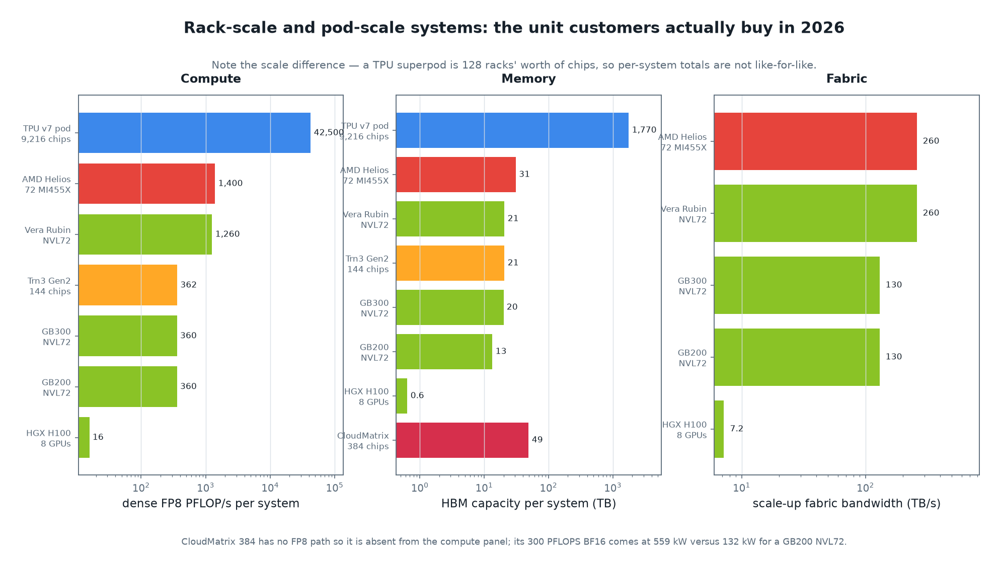

| System | Chips | BF16 PFLOP/s | FP8 PFLOP/s | FP4 PFLOP/s | HBM | HBM BW | Scale-up BW | Power | Price |
| --- | --- | --- | --- | --- | --- | --- | --- | --- | --- |
| **HGX H100 (8-GPU)** | 8 | 7.9 | 15.8 | — | 0.6 TB | 27 TB/s | 7 TB/s | 10 kW | $285,000 |
| **HGX B200 (8-GPU)** | 8 | 18.0 | 36.0 | 72.0 | 1.4 TB | 62 TB/s | 14 TB/s | 15 kW | $390,000 |
| **GB200 NVL72** | 72 | 180.0 | 360.0 | 720.0 | 13.4 TB | 576 TB/s | 130 TB/s | 132 kW | $3,100,000 |
| **GB300 NVL72** | 72 | 180.0 | 360.0 | 1,080.0 | 20.0 TB | 576 TB/s | 130 TB/s | 140 kW | $3,700,000 |
| **Vera Rubin NVL72** | 72 | 288.0 | 1,260.0 | 2,520.0 | 20.7 TB | 1,580 TB/s | 260 TB/s | — | — |
| **AMD Helios (MI455X)** | 72 | 362.0 | 1,400.0 | 2,900.0 | 31.0 TB | 1,700 TB/s | 260 TB/s | 130 kW | — |
| **TPU v7 Ironwood pod** | 9,216 | 21,300.0 | 42,500.0 | — | 1,770.0 TB | 68,000 TB/s | — | 10,000 kW | — |
| **TPU 8t pod** | 9,600 | — | — | 121,000.0 | 2,074.0 TB | 62,700 TB/s | — | — | — |
| **Trainium3 Gen2 UltraServer** | 144 | 96.6 | 362.4 | 362.4 | 20.7 TB | 706 TB/s | — | — | — |
| **Huawei CloudMatrix 384** | 384 | 300.0 | — | — | 49.2 TB | — | — | 559 kW | — |
| **Cerebras CS-4 (3 wafers)** | 3 | — | — | — | 0.1 TB | 129,600 TB/s | — | 130 kW | — |
| **NVIDIA LPX (Groq 3)** | 256 | — | 315.0 | — | 0.1 TB | 40,000 TB/s | 640 TB/s | — | — |

Read this table with the chip counts in view: a TPU v7 superpod is 9,216 chips, roughly 128 NVL72 racks' worth, so its totals are not a like-for-like comparison with a single rack. What *is* comparable is the per-rack progression — GB200 → GB300 → Vera Rubin roughly triples FP4 throughput and quadruples fabric bandwidth in about eighteen months — and the fact that AMD's Helios matches NVIDIA's 72-chip domain while carrying 50% more HBM.

---

## 6. AMD, Intel and Huawei

### 6.1 AMD Instinct

| Accelerator | Launch | Process | Memory | BW (TB/s) | BF16 dense | FP8 dense | FP4 dense | TDP | Scale-up | Domain | Unit price |
| --- | --- | --- | --- | --- | --- | --- | --- | --- | --- | --- | --- |
| **Instinct MI250X** | 2021-Q4 | TSMC N6 | 128 GB HBM2e | 3.20 | 383 TF | — | — | 560 W | — | 8 | unknown |
| **Instinct MI300X** | 2023-Q4 | TSMC N5/N6 | 192 GB HBM3 | 5.30 | 1,307 TF | 2,615 TF | — | 750 W | 896 GB/s | 8 | $16,500 (estimate) |
| **Instinct MI325X** | 2024-Q4 | TSMC N5/N6 | 256 GB HBM3e | 6.00 | 1,307 TF | 2,615 TF | — | 1,000 W | 896 GB/s | 8 | $20,000 (estimate) |
| **Instinct MI355X** | 2025-Q2 | TSMC N3/N6 | 288 GB HBM3e | 8.00 | 2,517 TF | 5,033 TF | 10,066 TF | 1,400 W | 1,075 GB/s | 8 | $25,000 (estimate) |
| **Instinct MI455X (Helios)** | 2026-Q3 | 2nm-class (reported) | 432 GB HBM4 | 23.30 | 5,033 TF | 19,400 TF | 40,260 TF | — | 3,611 GB/s | 72 | unknown |

AMD's strategy is legible from the table: **compete on memory, match on low precision, and give away nothing on openness.** MI300X shipped 192 GB when H100 had 80; MI355X shipped 288 GB at 8 TB/s in the same window as B200's 180–192 GB; MI455X ships 432 GB of HBM4 against Rubin's 288 GB. AMD's own Helios claim against Vera Rubin NVL72 is 15% more peak FP4, **50% more HBM capacity**, 6% more HBM bandwidth and 50% more scale-out bandwidth. The capacity claim is the structurally defensible one.

Three things to know beyond the specifications.

**MI300X and MI325X have identical compute.** MI325X is purely a memory upgrade (192 → 256 GB, 5.3 → 6.0 TB/s) bought with 250 W. Same pattern as H100 → H200.

**CDNA 4 deprioritised FP64** just as Blackwell Ultra did: 163.4 → 78.6 TFLOP/s. The HPC-and-AI dual-purpose era is over on both sides.

**Helios is an open-standards rack.** 72 MI455X in an OCP Open Rack Wide, 18 EPYC Venice CPUs, 31 TB of HBM4, 260 TB/s of scale-up over **UALink-over-Ethernet** with single-hop all-to-all, 43 TB/s of scale-out over Ultra Ethernet, in production and shipping late Q3 2026. AMD's bet is that open fabrics plus more memory beat a mature proprietary stack for inference-dominated workloads, where kernel diversity is lower than in research training.

**The MI455X bandwidth number is genuinely disputed.** AMD's newsroom says 1.7 PB/s per Helios rack (23.3 TB/s per GPU, which matches a physical derivation from 12 HBM4 stacks × 2,048-bit at ~7.6 GT/s); Supermicro's datasheet says 1.4 PB/s (19.6 TB/s). Both sets are internally self-consistent, so this is two specifications rather than a typo — likely a peak-theoretical versus conservative-binned figure. AMD also labels none of the MI455X throughput figures dense or sparse while benchmarking them against NVIDIA's dense NVFP4. (estimate; flagged)

**Where ROCm actually stands in 2026.** Solved: upstream PyTorch works out of the box, vLLM and SGLang treat Instinct as first-class, Hugging Face models load, and Triton has a real AMD backend — which matters more than it sounds, because it gives a portable path for a large fraction of the ecosystem's hand-written kernels. Still friction: custom CUDA kernels need porting, RCCL multi-node collective tuning is much less well-trodden than NCCL's, new techniques (novel attention variants, quantisation schemes, MoE kernels) land on CUDA first by months, and profiling and debugging tooling is thinner.

The evidence that training on AMD is now real rather than theoretical:

- **Zyphra's ZAYA1**, the first large-scale MoE foundation model pretrained end-to-end on AMD hardware, networking and software: 128 nodes × 8 MI300X = **1,024 GPUs**, 8× Pensando Pollara 400 Gbps NICs per node, over 750 aggregate BF16 PFLOP/s measured, ROCm 6.4, Apache 2.0 weights. Critically, MI300X's 192 GB let Zyphra pretrain "primarily using a simpler parallelism strategy, namely data-parallelism with the ZeRO-1 distributed optimizer," avoiding expert and tensor sharding entirely. That is the underrated argument for high-capacity HBM: it buys *simplicity*, and every parallelism axis you avoid is a class of bugs you do not debug. The paper also contributes the first published RCCL-over-Pollara collective microbenchmarks at that scale. (confirmed)
- **MLPerf Training v5.1**, audited, 8-GPU FP8 Llama 2 70B LoRA:

| Round | Benchmark | Platform | Accelerators | Time to train |
| --- | --- | --- | --- | --- |
| v5.1 | Llama 2 70B LoRA | MI355X | 8 | 10.18 min |
| v5.0 | Llama 2 70B LoRA | GB200 | 8 | 11.14 min |
| v5.1 | Llama 2 70B LoRA | MI350X | 8 | 12.23 min |
| v5.1 | Llama 2 70B LoRA | MI325X | 8 | 21.05 min |
| v5.0 | Llama 2 70B LoRA | H100 | 8 | 27.93 min |
| v5.1 | Llama 2 70B LoRA | MI300X | 8 | 28.02 min |
| v5.1 | Llama 3.1 8B | MI355X | 8 | 99.71 min |
| v5.1 | Llama 3.1 8B | MI350X | 8 | 122.93 min |

MI355X at 10.18 minutes against NVIDIA's 11.145-minute GB200 result is close to parity — but note the rounds differ by six months of NVIDIA software optimisation, and in v6.0 AMD did not submit to the two new MoE benchmarks, so no full-suite like-for-like comparison exists. Nine OEM partners submitted on Instinct in v5.1, the broadest AMD ecosystem participation so far. (confirmed)

### 6.2 Intel

| Accelerator | Launch | Process | Memory | BW (TB/s) | BF16 dense | FP8 dense | FP4 dense | TDP | Scale-up | Domain | Unit price |
| --- | --- | --- | --- | --- | --- | --- | --- | --- | --- | --- | --- |
| **Gaudi 2** | 2022-Q2 | TSMC N7 | 96 GB HBM2e | 2.46 | 432 TF | 865 TF | — | 600 W | 600 GB/s | 8 | $8,125 (list) |
| **Gaudi 3** | 2024-Q3 | TSMC N5 | 128 GB HBM2e | 3.67 | 1,835 TF | 1,835 TF | — | 900 W | 1,200 GB/s | 8 | $15,625 (list) |
| **Ascend 910B** | 2023-Q3 | SMIC N+1/N+2 | 64 GB HBM2e | 1.60 | 400 TF | — | — | — | — | — | $10,000 (estimate) |
| **Ascend 910C** | 2025-Q1 | SMIC 7nm | 128 GB HBM2e | 3.20 | 780 TF | — | — | 600 W | 350 GB/s | 384 | $15,000 (estimate) |

Gaudi 3's genuine differentiator is that **scale-up and scale-out both run on the same on-die Ethernet NICs**: 24 × 200 Gb/s RoCE v2 giving 1,200 GB/s per accelerator, with an 8-OAM node fully peer-to-peer and **no switch inside the node**. Intel's pitch was explicitly about avoiding "risky investments in locked, proprietary technologies such as NVLink, NVSwitch, and InfiniBand," and it claims 33% more I/O per accelerator than H100.

The unusual fact about Intel is price transparency: it is the only vendor that ever published accelerator list prices — **$125,000 for an 8-card Gaudi 3 baseboard including networking** (≈$15,625 per accelerator) and $65,000 for Gaudi 2, positioned at two-thirds and one-third of "comparable competitive platforms." Any comparison against an HGX system should add InfiniBand or Ethernet NIC cost to the NVIDIA side, since Gaudi's fabric is on-die. (confirmed)

The architectural catch: **Gaudi 3's FP8 rate equals its BF16 rate** at 1,835 TFLOP/s. There is no 2× FP8 speedup — Gaudi 2 had one. For FP8-heavy inference that is roughly half an H100's dense FP8 throughput, while being competitive on BF16 and ahead on memory.

**Falcon Shores was cancelled as a product** in January 2025 — "an internal test chip only, without bringing it to market" — with a revealing stated reason: "it's not enough to just deliver the silicon… what customers really want is that full-scale rack solution." Intel also missed its $500M Gaudi 3 revenue target, citing software. What replaced it is a deliberate retreat from the frontier: **Crescent Island** (announced October 2025, sampling H2 2026) uses **160 GB of LPDDR5X rather than HBM** and is air-cooled, sidestepping HBM supply competition entirely at the cost of bandwidth far below any HBM part. It is a "tokens-as-a-service" inference capacity play. **Jaguar Shores** is the announced rack-scale answer, with no published specifications or date. (confirmed)

### 6.3 Huawei

Ascend 910C is a dual-die DaVinci part on SMIC 7nm: 780 dense BF16 TFLOP/s, 128 GB HBM2e at 3.2 TB/s, roughly 600 W, and — the single biggest handicap — **no native FP8 or FP4 path**, arriving only with the Ascend 950 generation. Every low-precision throughput multiplier the rest of the industry is monetising is unavailable.

Provenance warning: Huawei publishes no 910C datasheet. The canonical figures trace to Huawei's own CloudMatrix paper, **arXiv:2506.12708 version 1** — version 2 deleted the sentence giving the chip's throughput and version 3 renamed the part, so citations must be pinned to v1. (estimate)

**CloudMatrix 384** is the system that matters, and it is an honest statement of the strategy: 384 Ascend 910C delivering about 300 BF16 PFLOP/s and 49.2 TB of HBM — roughly 1.9× the compute and 3.6× the memory of a GB200 NVL72 — at **559 kW against 132 kW**. Per-chip efficiency is roughly a third of NVIDIA's. It is a brute-force answer to export controls: win at system level by spending the input China has (power) to compensate for the one it does not (leading-edge silicon and HBM).

The 2026 roadmap is aggressive and constrained by the same two things. **Ascend 950PR** (Q1 2026, ~1 PFLOPS FP8, 128 GB HiBL 1.0 at 1.6 TB/s) and **950DT** (Q4 2026, ~2 PFLOPS FP4, 144 GB HiZQ 2.0 at 4 TB/s) finally add FP8/FP4 and MXFP formats, with UB 2.0 cutting single-hop latency from 2 µs to 200 ns. The **Atlas 950 SuperPod** targets 8,192 chips, 8 EFLOPS FP8, and 16 PB/s of all-optical interconnect. A widely-reported 96 GB variant of the 950DT is read as a direct response to domestic HBM constraints. Production capacity is the binding limit: roughly 200,000 Ascend 910-series chips in 2025 against a 2026 target near 600,000, versus Chinese demand estimated at 1.0–1.5 million advanced AI chips. (estimate)

---

## 7. Google TPU, generation by generation

| Accelerator | Launch | Process | Memory | BW (TB/s) | BF16 dense | FP8 dense | FP4 dense | TDP | Scale-up | Domain |
| --- | --- | --- | --- | --- | --- | --- | --- | --- | --- | --- |
| **TPU v2** | 2017-Q3 | 16nm | 16 GB HBM | 0.70 | 46 TF | — | — | 280 W | 248 GB/s | 256 |
| **TPU v3** | 2018-Q4 | 16nm | 32 GB HBM | 0.90 | 123 TF | — | — | 450 W | 280 GB/s | 1,024 |
| **TPU v4** | 2020-Q4 | 7nm | 32 GB HBM2 | 1.20 | 275 TF | 275 TF | — | — | 300 GB/s | 4,096 |
| **TPU v5e** | 2023-Q3 | not published | 16 GB HBM2e | 0.80 | 197 TF | 393 TF | — | — | 400 GB/s | 256 |
| **TPU v5p** | 2023-Q4 | not published | 95 GB HBM2e | 2.77 | 459 TF | 459 TF | — | — | 1,200 GB/s | 8,960 |
| **TPU v6e (Trillium)** | 2024-Q4 | not published | 32 GB HBM | 1.64 | 918 TF | 918 TF | — | — | 800 GB/s | 256 |
| **TPU v7 (Ironwood)** | 2025-Q4 | TSMC N3P (reported) | 192 GB HBM3E | 7.38 | 2,307 TF | 4,614 TF | — | 1,000 W | 1,200 GB/s | 9,216 |
| **TPU 8t** | 2026-H2 | not published | 216 GB HBM | 6.53 | — | — | 12,600 TF | — | — | 9,600 |
| **TPU 8i** | 2026-H2 | not published | 288 GB HBM | 8.60 | — | — | 10,100 TF | — | — | 1,152 |

Google publishes no clock speed, process node or per-chip TDP for anything after v4, so those columns are blank rather than guessed. The ~1 kW figure used for Ironwood elsewhere in this report is inferred from "nearly 10 MW" for a 9,216-chip pod and therefore includes rack overhead.

### 7.1 What each generation was actually for

**v1 (2015), inference only.** A 256×256 systolic array at 700 MHz: 65,536 8-bit MACs × 0.7 GHz ≈ 92 TOPS, exactly Google's published figure. 28 nm, 75 W, 8 GB of DDR3.

**v2 (2017), the first trainable TPU.** Google shrank the array to 128×128 — a deliberate trade favouring utilisation on narrower matrices — added HBM and ICI links, and made a 256-chip pod.

**v3 (2018).** Two MXUs per TensorCore, 32 GB HBM, liquid cooling, 1,024-chip pods.

**v4 (2020, GA 2022).** The most important generation architecturally: 7 nm, **128 MiB of CMEM**, 4 SparseCores, and the first **optically reconfigurable 3D torus** at 4,096 chips per pod (1.1 EFLOPS BF16). The die is *smaller* than v3's despite twice the matrix multipliers. PaLM 540B was trained on 6,144 v4 chips; Gemini Ultra used "a large fleet of TPUv4 accelerators… across multiple datacenters"; Apple trained AFM-server on 8,192 v4 chips.

**v5e (2023), cost-optimised.** One TensorCore, 16 GB, 256-chip pods, air-cooled, and the cheapest TPU on the rate card at $1.20/chip-hour ($0.54 on a 3-year commit).

**v5p (2023), the training flagship of its era.** Megacore (two TensorCores presented as one logical core over a unified memory space), 95 GB HBM at 2.765 TB/s, 3D torus, single slices to 6,144 chips and **multislice to 18,432**.

**v6e Trillium (2024).** First 256×256 MXU, 918 dense BF16 TFLOP/s, back to 256-chip pods. Google's claim is 1.8× better performance per dollar than v5p (45% lower cost to train), with 99% weak-scaling efficiency across 8 Trillium-256 slices over multislice versus 94% for v5p within a single ICI domain. (confirmed as a vendor claim; the perf/$ number is unauditable within MLPerf)

**v7 Ironwood (2025, GA 2026).** The first dual-compute-die TPU: **2,307 dense BF16 / 4,614 FP8 TFLOP/s, 192 GiB HBM3E at 7.38 TB/s, 128 MiB VMEM, 4th-gen SparseCore with collective offloading, 1.2 TB/s ICI, 9,216-chip superpods at 42.5 FP8 EFLOPS with 1.77 PB of directly addressable shared HBM in nearly 10 MW.** Google claims 2× the perf/W of Trillium and about 30× its 2018 Cloud TPU. **No Ironwood MLPerf submission exists** — the most recent TPU training submission is Trillium in v5.0, June 2025 — so every Ironwood-versus-Blackwell training comparison in circulation is spec-sheet arithmetic. (confirmed for specs; flagged for comparisons)

**Eighth generation (announced April 2026): the split.** Google stopped building one chip for both jobs.

| | TPU 8t (training) | TPU 8i (inference) |
|---|---|---|
| Topology | 3D torus | **Boardfly** high-radix, Dragonfly-inspired |
| Pod | **9,600 chips** | 1,152 chips |
| HBM | 216 GB @ 6.53 TB/s | **288 GB @ 8.6 TB/s** |
| On-chip SRAM | 128 MB | **384 MB** (3× Ironwood) |
| Peak FP4 | **12.6 PFLOP/s** | 10.1 PFLOP/s |
| Specialised units | SparseCore + LLM Decoder Engine | **Collectives Acceleration Engine** replaces SparseCore |
| Claimed vs Ironwood | 2.7× perf/$ training, up to 2× perf/W | 80% better perf/$ inference |

(confirmed from Google's announcement and technical deep dive; the claimed multiples are vendor figures)

The reasoning Google published is the clearest statement anywhere of why topology follows workload: dense pretraining is neighbour-dominated, so 8t keeps the torus; MoE and reasoning are all-to-all-dominated, so 8i abandons it. Google shows the arithmetic — a 1,024-chip 8×8×16 torus has a 16-hop diameter, Boardfly reaches the same 1,024 chips in **7 hops**, a 56% reduction. 8t also adds **native FP4 in the MXU**, a more balanced VPU so quantisation and normalisation overlap better with matmul, and **TPUDirect RDMA and Storage** moving data between HBM and NICs or Lustre without transiting host DRAM. Both are hosted on Arm Axion CPUs, which Google says "removed the host bottleneck caused by data preparation latency." The Virgo fabric links over 134,000 8t chips with up to 47 Pb/s of non-blocking bisection, and Google states JAX plus Pathways can "scale to more than 1 million TPU chips in a single training cluster."

One caveat: secondary reporting of "331.8 exaFLOPS FP8 per 8i pod" does not reconcile — 1,152 chips × ~5 PFLOPS ≈ 5.8 EFLOPS, and 6.74 × Ironwood's 42.5 would be 286 EFLOPS, not 331.8. The 8t figure does reconcile cleanly (9,600 × 12.6 PFLOPS = 121 EFLOPS = 2.84 × Ironwood). Treat the 8i pod aggregate as unverified. (flagged)

### 7.2 Pricing — the one authoritative accelerator price list in the industry

TPUs are GCP-only: you cannot buy one, no third party resells them, and the only on-prem path is Google Distributed Cloud. In exchange, Google publishes real prices.

| Generation | On-demand | Flex-start (queued) | 1-year commit | 3-year commit |
|---|---|---|---|---|
| **v7 Ironwood** (us-central1) | **$12.00** | $6.00 | $8.40 | **$5.40** |
| v6e Trillium (us-east1/5) | $2.70 | $1.35 | $1.89 | $1.22 |
| v5p (us-east5) | $4.20 | $2.10 | $2.94 | $1.89 |
| v5e (us-central1) | $1.20 | $0.60 | $0.84 | $0.54 |
| v4 pod (us-central2) | $3.22 | — | $2.03 | $1.45 |

(confirmed — `cloud.google.com/tpu/pricing`, retrieved 20 August 2026)

Two structural features worth extracting. The **3-year commitment is a flat 55% discount** and the 1-year a flat 30%, across every generation. And **flex-start is a 50% discount with no commitment at all** — for Ironwood that is $6.00, cheaper than the 1-year commit. If your workload tolerates queuing, flex-start is the best rate available without signing anything. Note also that the console bills in VM-hours, not chip-hours: a 4-chip v4 host shows as $12.88/hour.

Spot pricing is not published as a table; Google says only that spot prices "can change up to once every 30 days."

Against that list price, SemiAnalysis estimates Anthropic pays about **$1.60 per Ironwood chip-hour** — 7.5× below list — and characterises the list as "car-salesman" pricing: "No major customers of TPUs is paying anywhere close to that much." (estimate)

### 7.3 Who trains on TPUs

- **PaLM 540B**: 6,144 v4 chips across two pods, 3,072 per pod on 768 hosts, model+data parallelism within a pod and pure data parallelism across pods. (confirmed)
- **Gemini**: "We trained Gemini models using TPUv5e and TPUv4… Training Gemini Ultra used a large fleet of TPUv4 accelerators owned by Google across multiple datacenters." Gemini 1.5 used multiple 4,096-chip v4 pods across datacenters. (confirmed)
- **Apple**: AFM-server on 8,192 TPU v4; AFM-on-device on 2,048 TPU v5p. Notable mainly as evidence that a company with no Google Cloud dependency chose TPUs on merit. (confirmed)
- **Anthropic**: up to **one million TPUs** and "well over a gigawatt of compute capacity online in 2026" (October 2025), expanded in April 2026 with Google and Broadcom to multiple further gigawatts from 2027 — roughly 3.5 GW per a Broadcom SEC filing. Google Cloud's CEO attributed the choice to TPU "price-performance and efficiency." (confirmed announcement; the 3.5 GW figure is filing-derived)

The Gemini infrastructure detail worth stealing: instead of periodic checkpointing to cluster storage, Google used **redundant in-memory copies of model state** and recovered from an intact replica, lifting goodput from 85% to 97%.

---

## 8. The other ASICs

<a id="8-the-other-asics"></a>

| Accelerator | Launch | Process | Memory | BW (TB/s) | BF16 dense | FP8 dense | FP4 dense | TDP | Scale-up | Domain | Unit price |
| --- | --- | --- | --- | --- | --- | --- | --- | --- | --- | --- | --- |
| **Trainium1** | 2022-Q4 | not published | 32 GB HBM | 0.80 | 191 TF | 191 TF | — | — | 384 GB/s | 16 | cloud-only |
| **Trainium2** | 2024-Q4 | not published | 96 GB HBM | 2.90 | 667 TF | 1,299 TF | — | — | 1,280 GB/s | 64 | cloud-only |
| **Trainium3** | 2025-Q4 | TSMC N3 | 144 GB HBM3e | 4.90 | 671 TF | 2,517 TF | 2,517 TF | — | 2,048 GB/s | 144 | cloud-only |
| **Inferentia2** | 2023-Q1 | not published | 32 GB HBM | 0.82 | 190 TF | 190 TF | — | — | — | — | cloud-only |
| **MTIA v2** | 2024-Q2 | TSMC N5 | 128 GB LPDDR5 | 0.20 | 177 TF | — | — | 90 W | — | — | internal |
| **MTIA 300** | 2026-Q1 | not published | 216 GB HBM | 6.10 | — | 1,200 TF | — | 800 W | — | — | internal |
| **MTIA 400** | 2026-H2 | not published | 288 GB HBM | 9.20 | 3,000 TF | 6,000 TF | 12,000 TF | 1,200 W | 150 GB/s | 72 | internal |
| **Maia 100** | 2024-Q2 | TSMC N5 | 64 GB HBM2E | 1.80 | 800 TF | — | — | 500 W | 600 GB/s | — | internal |
| **Maia 200** | 2026-Q1 | TSMC N3P | 216 GB HBM3e | 7.00 | 1,268 TF | 5,072 TF | 10,145 TF | 750 W | 2,800 GB/s | 6,144 | internal |
| **Cerebras WSE-3** | 2024-Q1 | TSMC N5 | 44 GB SRAM (on-wafer) | 21,000.00 | — | — | — | 23,000 W | — | 1 | system-only |
| **Groq LPU v1** | 2022-Q1 | GF 14nm | 230 MB SRAM only | 80.00 | 188 TF | — | — | 215 W | — | 1 | system-only |
| **Groq 3 LPU (NVIDIA LPX)** | 2026-Q3 | Samsung SF4X | 500 MB SRAM only | 150.00 | — | 1,230 TF | — | — | 2,500 GB/s | 256 | system-only |
| **SambaNova SN40L** | 2024-Q3 | TSMC N5 | 64 GB HBM+1.5TB DDR | 1.80 | 640 TF | — | — | — | — | 16 | system-only |
| **Tenstorrent Blackhole p150a** | 2025-Q2 | TSMC N6 | 32 GB GDDR6 | 0.51 | 332 TF | 664 TF | — | 300 W | 400 GB/s | 32 | $1,399 (list) |

### 8.1 AWS Trainium — the largest non-NVIDIA training fleet

AWS is unusually explicit about dense versus sparse, which makes its numbers easy to trust. Trainium2: 8 NeuronCore-v3, **1,299 dense FP8 TFLOP/s** (2,563 sparse), 96 GiB HBM at 2.9 TB/s, 224 MiB of SBUF on-chip SRAM, NeuronLink-v3 at 1.28 TB/s, and a **64-chip UltraServer** memory pool. Trainium3 (GA December 2025) is AWS's first 3 nm chip: **2,517 dense MXFP8 TFLOP/s**, 144 GB HBM3e at 4.9 TB/s, NeuronLink-v4 at 2 TB/s, and a **144-chip scale-up domain** built as 36 servers × 4 chips behind a two-level NeuronSwitch — "optimized for… Mixture of Experts models and autoregressive inference serving."

Confirmed by Amazon: the chips business is now at a **>$25B revenue run rate**; Anthropic has committed to **up to 5 GW** of current and future Trainium and runs Claude on **over one million Trainium2 chips**; **OpenAI has committed to 2 GW** of Trainium capacity from 2027; Trn3 UltraServers deliver up to 4.4× the compute of Trn2 and **>5× the output tokens per megawatt**.

**Project Rainier** is the physical expression: an $11B, 1,200-acre campus in New Carlisle, Indiana, operational from late October 2025 with roughly **500,000 Trainium2 chips** in 7 of 30 planned buildings, sized for eventual 2.2 GW. AWS calls it "the world's largest cluster of non-NVIDIA AI chips." Be careful with chip counts in circulation: ~500k at New Carlisle, >1M in Anthropic's company-wide fleet, and ~1.4M Trainium2 deployed across all AWS customers are three different numbers. (confirmed / estimate as noted)

Pricing: only Trn1 has a full public on-demand rate card ($1.34 per chip-hour). For Trn2, the citable AWS-published rate is **Capacity Blocks at $2.235 per chip-hour**; third-party trackers showing ~$0.54 per Trainium2 chip-hour are almost certainly spot and should not be planned against. Trainium3 has no published public price at all. (confirmed / flagged)

For calibration at published rates: Trainium2 is about **$1.72 per dense FP8 PFLOP-hour** versus Ironwood at $2.60 on-demand or $1.17 on a 3-year commit.

### 8.2 Meta MTIA — internal-only, and the most candid roadmap

MTIA is not for sale and not rentable, but Meta publishes unusually detailed specifications and, more valuable, unusually honest caveats. MTIA v2: TSMC N5, 421 mm², 8×8 PE grid at 1.35 GHz, **354 dense INT8 / 177 dense BF16 TFLOP/s**, 256 MB of on-chip SRAM at 2.7 TB/s, and **128 GB of LPDDR5 at only 204.8 GB/s** — entirely appropriate for ranking and recommendation, where the bottleneck is embedding capacity and random access rather than sequential bandwidth, and the reason its perf/W (7.8 TOPS/W) beats an H100's (5.65).

Meta's admission about sparsity is the single most useful sentence any vendor has published on the subject: 2:4 sparsity is in the hardware, but "our production experience indicates that exploiting sparsity is challenging due to potential quality loss in our recommendation models… **this feature is not yet widely used in production**."

The March 2026 roadmap is four generations on a roughly six-month cadence, enabled by modular chiplets sharing one chassis, rack and network: **MTIA 300** (in production, 1.2 PFLOPS FP8, 216 GB @ 6.1 TB/s, 800 W), **MTIA 400** (deploying 2026, 6 PFLOPS FP8 / 12 PFLOPS MX4, 288 GB @ 9.2 TB/s, 1,200 W, **72 devices in one scale-up domain**), then 450 and 500 in 2027. Meta inverts the industry's usual logic explicitly: "Mainstream chips are typically built for the most demanding workload — large-scale GenAI pre-training — and then applied, often less cost-effectively, to other workloads… **We take the opposite approach**: MTIA 450 and 500 are optimized first for GenAI inference." Everything is built on PyTorch, vLLM, Triton and OCP standards.

Flag: the published MTIA 450/500 FP8 figures (7 and 10 PFLOPS) do not reconcile with Meta's own claim of a 25× compute increase from MTIA 300 to 500 (which would be 30 PFLOPS), while the bandwidth claim of 4.5× checks out exactly. Treat those two compute numbers as unresolved.

### 8.3 Microsoft Maia

Maia 100 (2024) was a supply-strategy statement as much as a chip: TSMC N5, ~820 mm², **3 POPS at 6-bit / 1.5 POPS at 9-bit / 0.8 POPS BF16**, ~500 MB of L1/L2 scratchpad, and deliberately **HBM2E rather than HBM3** — as ServeTheHome put it, "Microsoft is not competing with NVIDIA and AMD for leading-edge HBM supply." It never went beyond internal Azure OpenAI workloads.

**Maia 200** (announced 26 January 2026, in production in US Central) is a serious part: TSMC 3 nm, >140B transistors, **10.1 PFLOPS FP4 / 5.07 PFLOPS FP8 / 1.27 PFLOPS BF16**, 216 GB HBM3e at ~7 TB/s, **272 MB of fully software-managed SRAM**, 2.8 TB/s of scale-up bandwidth over an integrated on-die NIC, and a scale-up domain of **up to 6,144 accelerators** over two-tier Ethernet with a custom AI Transport Layer. Microsoft's framing — "compilers and runtimes can place working sets explicitly to keep attention and GEMM kernels close to compute" — is a description of a TPU-style scratchpad hierarchy, not a cache. It serves GPT-5.2 among other models, targets synthetic data generation and reinforcement learning pipelines as well as inference, and Microsoft has said it "will be made available for lease to a broader customer base in the future." No public price. (confirmed)

### 8.4 Cerebras — wafer-scale

WSE-3: **46,225 mm² of silicon (a full 21.5 × 21.5 cm wafer), 4 trillion transistors, 900,000 cores, 44 GB of on-wafer SRAM at 21 PB/s, no HBM at all, ~23 kW per CS-3 system.** Yield is handled by designing for defects — redundant cores and routing, fail-in-place.

Two caveats matter more than any spec. First, **the headline "125 PFLOPS" is sparse FP16**, and Cerebras's sparsity is unstructured, so it cannot be compared to a dense GPU number; Cerebras publishes no dense equivalent. Second, the August 2026 **CS-4 is not new silicon**: the WSE-3 Turbo carries the same 4T transistors, 900k cores, 44 GB SRAM and 5 nm node, and doubles throughput by roughly doubling the clock (~1.4 → ~2.8 GHz) on the back of a redesigned power path that moved conversion "100 times closer to the processors." Both compute and power roughly doubled, so **perf/W is at best slightly improved**; what genuinely improved is per-rack throughput and memory bandwidth per user, which is what determines tokens/sec/user on decode. A CS-4 rack is 3 wafers, 750 sparse-FP16 PFLOPS, 129.6 PB/s of memory bandwidth, 125–140 kW, shipping Q3 2026. (confirmed / estimate as noted)

Cerebras is not the cheapest per token — several GPU providers undercut it, and above roughly 8 concurrent requests a rented H100 running vLLM with continuous batching produces more tokens per dollar. The value case is latency: ~3,000 tokens/sec on GPT-OSS-120B, ~1,800 on Llama 3.3 70B.

### 8.5 Groq — now part of NVIDIA

Important framing: **Groq's inference silicon is no longer an independent alternative.** In December 2025 NVIDIA licensed the LPU technology for **$20 billion**, the largest deal in its history, including acqui-hiring founder Jonathan Ross, and at GTC 2026 the result shipped as the **NVIDIA Groq 3 LPU**. Jensen Huang compared the integration to Mellanox.

The architecture remains the purest expression of compiler-scheduled determinism in shipping silicon, and it is directly relevant to the TPU comparison:

- **No DRAM whatsoever.** Weights live in SRAM: 230 MB at 80 TB/s on v1, 512 MB at 150 TB/s on Groq 3. Groq's framing: on-chip SRAM has "memory bandwidth upwards of 80 terabytes/second, while GPU off-chip HBM clocks in at about eight." The cost is capacity — serving Llama 2 70B took roughly **576 LPUs** on v1 silicon.
- **Compiler-first, literally:** "We didn't touch chip design until the compiler's architecture was designed."
- **Plesiosynchronous chip-to-chip links** that cancel clock drift so hundreds of LPUs behave as one logical core — determinism extended past the die boundary, which even TPUs do not attempt.

An LPX rack is 256 LPUs, 128 GB of aggregate SRAM, 40 PB/s of aggregate bandwidth, 315 PFLOPS FP8, shipping H2 2026 as the decode partner to a Vera Rubin NVL72. (confirmed)

### 8.6 SambaNova and Tenstorrent

**SambaNova SN40L** is the only shipping accelerator with a tightly coupled **three-tier memory system**: 520 MiB of on-chip PMU SRAM, 64 GiB of HBM at 1.8 TB/s, and up to 1.5 TiB of pluggable DDR at >200 GB/s, with a DDR→HBM load rate above 1 TB/s. The design target is *model switching*, not raw throughput — hundreds of models resident in DDR, swapped into HBM in microseconds, aimed at composition-of-experts and agentic serving. Its dataflow execution model fuses operations into a single kernel call so data never returns to memory between stages; the ISSCC/arXiv paper reports 2×–13× speedups on 8 sockets against an unfused baseline. A 16-socket rack is 10.2 BF16 PFLOPS and runs DeepSeek R1 671B. (confirmed)

**Tenstorrent** is the only vendor here that publishes hardware list prices and sells retail: **Blackhole p150a at $1,399** for 120 Tensix cores, 180 MB of SRAM, 32 GB of GDDR6 at 512 GB/s, 664 TFLOPS BLOCKFP8, 300 W, four QSFP-DD 800G ports for direct card-to-card meshing, and a fully open-source RISC-V stack. A 32-chip Galaxy rack is 23 PFLOPS BLOCKFP8 from $110,000. Note a spec revision: Tenstorrent previously published 140 cores and 774 TFLOPS; after a February 2026 firmware update the official figures are **120 cores and 664 TFLOPS**, and many third-party pages still carry the old numbers. The counterweight is decisive for most buyers: GDDR6 at 512 GB/s is 6–15× below any HBM part, there is no cloud marketplace offering Tenstorrent capacity, and the software maturity gap is larger than AMD's. (confirmed)

### 8.7 What the field looks like after twelve months of consolidation

The non-NVIDIA field narrowed sharply. Intel cancelled Falcon Shores and retreated to LPDDR5X inference parts. NVIDIA bought Groq's technology and used it to displace its own Rubin CPX. Cerebras shipped a clock bump rather than new silicon. Meanwhile the hyperscalers went the other way: Google split its eighth generation into two purpose-built chips, Meta announced four generations in two years, Microsoft shipped Maia 200 on 3 nm, and AWS shipped 3 nm Trainium3.

**The viable non-NVIDIA path has narrowed to vertically integrated hyperscaler silicon plus AMD, and Huawei inside China.** Merchant challengers without a captive workload have not found a durable position.

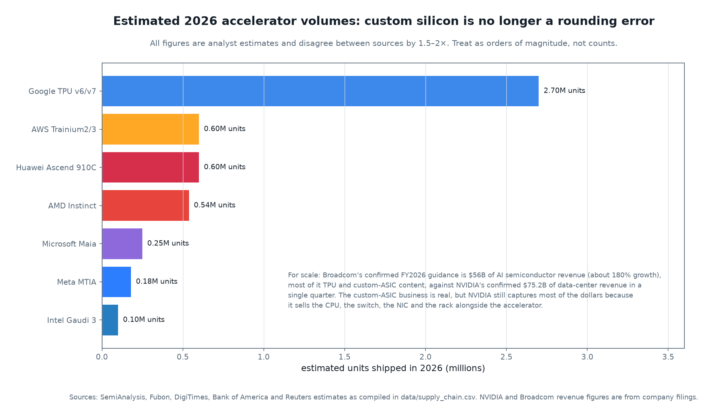

---

## 9. Head to head

### 9.1 Everything relative to one H100

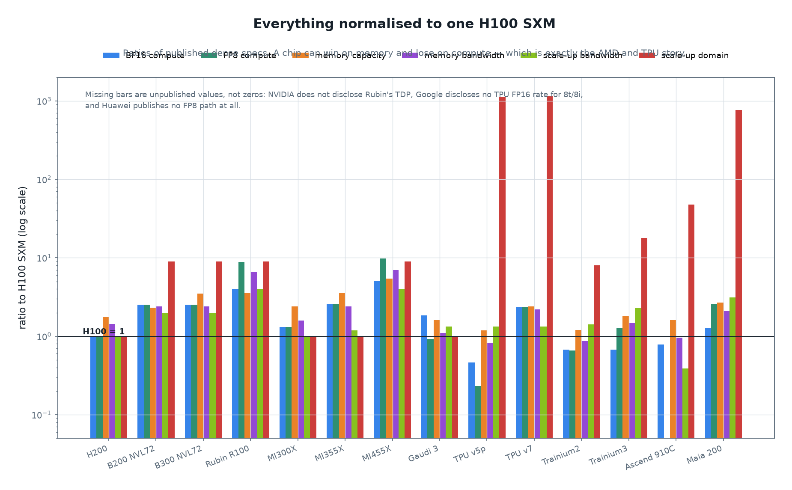

The pattern in that figure is the single most useful thing to internalise: **no current accelerator wins on every axis, and the axes are not equally important for your workload.**

| If your bottleneck is… | The winner is… | Because |
|---|---|---|
| Dense training FLOPs per chip | Rubin R100, then MI455X | 4.0 / 5.0 dense BF16 PFLOP/s |
| Low-precision training throughput | Rubin R100 | 17.5 dense FP8 PFLOP/s, 3rd-gen Transformer Engine, NVFP4 recipes |
| Memory capacity per chip | MI455X (432 GB), then TPU 8i (288 GB) | fewer shards, simpler parallelism |
| Memory bandwidth per chip | MI455X (~23 TB/s), Rubin (22 TB/s) | HBM4 roughly triples bandwidth |
| Tensor-parallel headroom | TPU pods (9,216), then NVL72 / Helios (72) | scale-up domain size |
| Determinism at scale | TPU | static schedule, OCS fault isolation |
| Cost per token served | depends entirely on contract | see §10 |
| Software risk | NVIDIA | breadth, day-one format support |

The memory plane is where the field is least NVIDIA-shaped, and it deserves its own view because capacity and bandwidth trade against each other differently for every vendor:

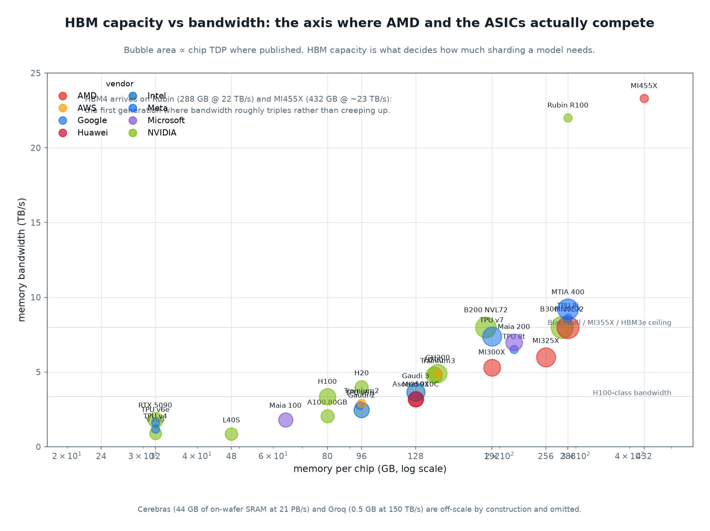

Three things stand out. AMD has led on capacity for three straight generations and now leads on bandwidth too. HBM4 is the first generation where bandwidth roughly triples rather than creeping up — 22 TB/s on Rubin and about 23 TB/s on MI455X, against 8 TB/s for the entire Blackwell/MI355X generation. And the cost-optimised inference parts (TPU v5e and v6e at 16–32 GB, MTIA v2 on LPDDR5 at 205 GB/s, L4 at 300 GB/s) sit far below the frontier deliberately: for recommendation and ranking the bottleneck is embedding capacity and random access, not sequential bandwidth, and paying for HBM there is waste.

### 9.2 Efficiency

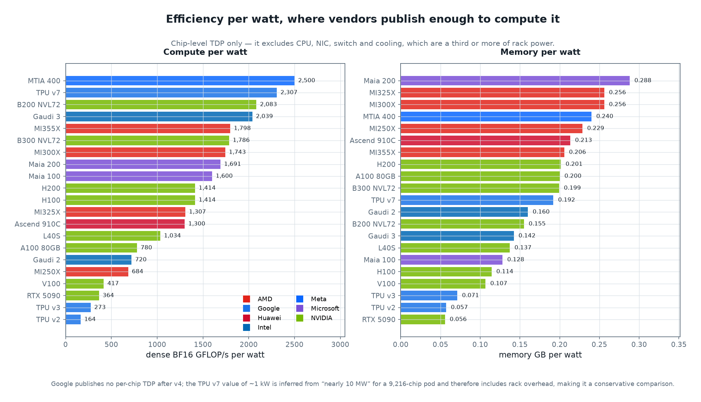

Chip-level perf/W favours the specialised parts, and the ordering is stable across metrics: TPU and Maia-class ASICs lead on memory per watt, Blackwell leads on compute per watt among GPUs, and Huawei's 910C trails badly because it lacks low-precision paths and rides an older node.

Three caveats keep this honest. First, chip TDP excludes CPU, NIC, switch and cooling, which are a third or more of rack power. Second, Google publishes no per-chip TDP after v4, so Ironwood's ~1 kW is inferred from pod power and *includes* overhead, making its position conservative. Third, all published perf/W comparisons across vendors are vendor claims — Google's "2× Trillium and 2.8× H100", Amazon's "2.1× Trainium2", NVIDIA's Rubin figures — and **no independent third-party benchmark comparing Ironwood against NVIDIA hardware existed as of August 2026.**

### 9.3 What the audited benchmarks say

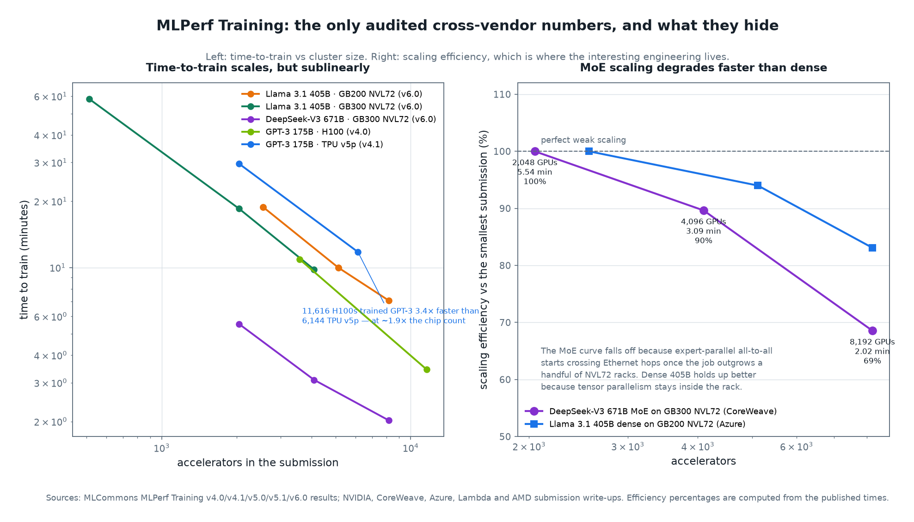

MLPerf Training v6.0 (June 2026), 24 organisations, 95 unique systems, 13 accelerators, 60% multi-node:

| Benchmark | Platform | Accelerators | Time to train |
| --- | --- | --- | --- |
| DeepSeek-V3 671B | GB300 NVL72 | 2,048 | 5.54 min |
| DeepSeek-V3 671B | GB300 NVL72 | 4,096 | 3.09 min |
| DeepSeek-V3 671B | GB300 NVL72 | 8,192 | 2.02 min |
| GPT-OSS 20B | GB300 NVL72 | 512 | 7.43 min |
| Llama 2 70B LoRA | GB300 NVL72 | 512 | 0.40 min |
| Llama 3.1 405B | GB300 NVL72 | 512 | 58.30 min |
| Llama 3.1 405B | GB300 NVL72 | 2,048 | 18.50 min |
| Llama 3.1 405B | GB200 NVL72 | 2,560 | 18.80 min |
| Llama 3.1 405B | GB300 NVL72 | 4,096 | 9.80 min |
| Llama 3.1 405B | GB200 NVL72 | 5,120 | 10.00 min |
| Llama 3.1 405B | GB200 NVL72 | 8,192 | 7.07 min |

The round added two MoE benchmarks — DeepSeek-V3 671B and GPT-OSS 20B — and MLCommons was explicit about why the DeepSeek-V3 benchmark mandates a global batch size of at least 15,360: to prevent "'hero runs' on tiny batch sizes that don't reflect production-scale MoE training." A benchmark body defending against a known gaming vector is a sign of a maturing suite.

The most useful single result is CoreWeave's DeepSeek-V3 scaling ladder, because it is one workload on one platform at three scales: 2,048 GPUs in 5.54 min, 4,096 in 3.09 min (**89.6% scaling efficiency**), 8,192 in 2.02 min (**68.6%**). Near-linear to 4k, clearly sublinear beyond — which is what you expect once expert-parallel all-to-all starts crossing Spectrum-X hops rather than staying inside NVL72 racks. Azure's dense Llama 3.1 405B curve holds up better (83% at 8,192 GPUs against a 40-rack baseline) because tensor parallelism stays inside the rack.

**Eight ways these numbers mislead**, worth stating because they are all common:

1. "Fastest on every benchmark" is partly a coverage claim. NVIDIA was the only vendor submitting to all seven v6.0 workloads; AMD skipped both MoE benchmarks.
2. Time-to-train at maximum scale measures the cluster, not the chip. 3.44 min on 11,616 H100s versus 11.77 min on 6,144 TPU v5p is ~1.8× per chip, not 3.4×.
3. **There is no perf-per-dollar or perf-per-watt metric in the closed division.** Every cost-efficiency claim — Google's Trillium perf/$, AMD's tokens-per-dollar — is unauditable within MLPerf.
4. Cross-round comparisons are not like-for-like: AMD's v5.1 MI355X result against NVIDIA's v5.0 GB200 result spans six months of NVIDIA software work.
5. Submitters choose their scale, and small-scale entries are cherry-picked.
6. The benchmark models lag production. GPT-3 175B was the LLM pretraining benchmark until v5.1, five years after the model.
7. Preview and RDI tiers are not products. Check the tier before quoting.
8. Vendor blog numbers are not MLPerf numbers. Zyphra's ">750 PFLOPs" is footnoted as an internal measurement of "a set of subsequent MLPs in BFLOAT16," not a training workload — an honest disclosure that gets dropped when the number is repeated.

And the biggest gap of all: **no TPU has been submitted since Trillium in v5.0 (June 2025).** Google submitted to v6.0 on NVIDIA hardware, focusing on DeepSeek-V3. So the two most-discussed accelerators of 2026, Ironwood and Blackwell Ultra, have never met in an audited benchmark.

### 9.4 Real training runs, for calibration

| Model | Params (B) | Active (B) | Tokens (T) | Training FLOP | Hardware | Chips | Chip-hours (M) | MFU | Confidence |
| --- | --- | --- | --- | --- | --- | --- | --- | --- | --- |
| **GPT-3 175B** | 175 | 175 | 0.30 | 3.14e23 | V100 | — | — | — | estimate |
| **Chinchilla 70B** | 70 | 70 | 1.40 | 5.76e23 | TPU v3/v4 | — | — | — | confirmed |
| **PaLM 540B** | 540 | 540 | 0.78 | 2.53e24 | TPU v4 | 6,144 | — | 46% | confirmed |
| **Llama 2 70B** | 70 | 70 | 2.00 | 8.40e23 | A100 80GB | — | 1.72 | — | confirmed |
| **GPT-4** | 1,800 | 280 | 13.00 | 2.10e25 | A100 | 25,000 | — | — | estimate |
| **Gemini 1.0 Ultra** | — | — | — | 5.00e25 | TPU v4 | — | — | — | estimate |
| **Apple AFM-server** | — | — | — | — | TPU v4 | 8,192 | — | — | confirmed |
| **Llama 3.1 405B** | 405 | 405 | 15.60 | 3.80e25 | H100 80GB | 16,384 | 30.84 | 41% | confirmed |
| **DeepSeek-V3** | 671 | 37 | 14.80 | 3.70e24 | H800 | 2,048 | 2.79 | — | confirmed |
| **Grok-2** | — | — | — | 3.00e25 | H100 | — | — | — | estimate |
| **NVFP4 12B** | 12 | 12 | 10.00 | 7.20e23 | Blackwell | — | — | — | confirmed |
| **Grok-3** | — | — | — | 4.60e26 | H100/H200 Colossus | 150,000 | — | — | estimate |
| **GPT-4.5** | — | — | — | 3.80e26 | H100 Azure | — | — | — | estimate |
| **Grok 4** | — | — | — | 5.00e26 | H100/H200 Colossus | — | — | — | estimate |

Two observations. First, disclosure has collapsed: everything after 2024 is a reconstruction from hardware counts and durations, so the visible frontier is a record of *publicised successful runs*, not of compute spent. Second, Epoch AI's decomposition of the 4–5×-per-year growth in training compute is the least intuitive and most important fact here: the median annual factors are **hardware quantity 1.69×, training duration 1.53×, per-chip throughput 1.41×.** Most compute growth comes from buying more chips and running longer, not from faster chips. That is why datacenter power, packaging capacity and cluster reliability — not FLOPS per die — are the binding constraints in 2026.

---

## 10. Supply, price and the economics

### 10.1 What a chip costs to build

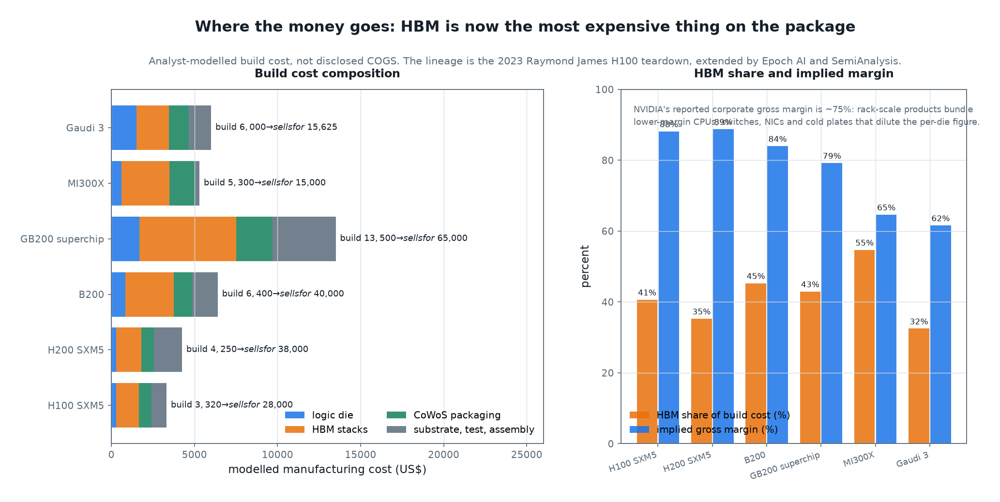

No vendor discloses per-part cost of goods. The estimates below descend from the 2023 Raymond James H100 teardown, extended by Epoch AI, TrendForce and SemiAnalysis; the H100 row has been independently reproduced several times, the Blackwell rows are weaker. (all estimate)

| Chip | Logic die | HBM | CoWoS packaging | Substrate/test/assembly | Total build | Modelled sell | Implied margin |
|---|---|---|---|---|---|---|---|
| H100 SXM5 | $300 | **$1,350** | $750 | $920 | $3,320 | $28,000 | ~88% |
| H200 SXM5 | $300 | $1,500 | $750 | $1,700 | $4,250 | $38,000 | ~89% |
| B200 | $850 | **$2,900** | $1,100 | $1,550 | $6,400 | $40,000 | ~84% |
| GB200 superchip | $1,700 | $5,800 | $2,200 | $3,800 | $13,500 | $65,000 | ~79% |
| MI300X | $600 | $2,900 | $1,500 | $300 | $5,300 | $15,000 | ~65% |
| Gaudi 3 | $1,500 | $1,950 | $1,200 | $1,350 | $6,000 | $15,625 | ~62% |

HBM's share of build cost went from ~14% on A100 to 33–41% on H100 to ~45% on MI300X. On a B200 the memory costs roughly 3.4× the logic silicon.

The 84–88% implied per-die margins are not inconsistent with NVIDIA's **confirmed 74.9% corporate gross margin**, because rack-scale products bundle Grace CPUs, NVSwitches, ConnectX NICs, cabling and cold plates at lower margin, and because the model excludes R&D amortisation — Jensen Huang has put the NV-HBI die-to-die interconnect alone at about $10B of development.

Wafer prices, for the same reason people ask: N7 ~$10k, N5 ~$17k, N3 ~$21.5k in 2026, N2 ~$30k (though TrendForce argues the real N2-versus-N3 premium is 10–20%, not 50%), A16 ~$45k. A fully processed CoWoS wafer runs $10–12k with the interposer alone at 50–70% of packaging cost. (estimate)

### 10.2 The two real chokepoints

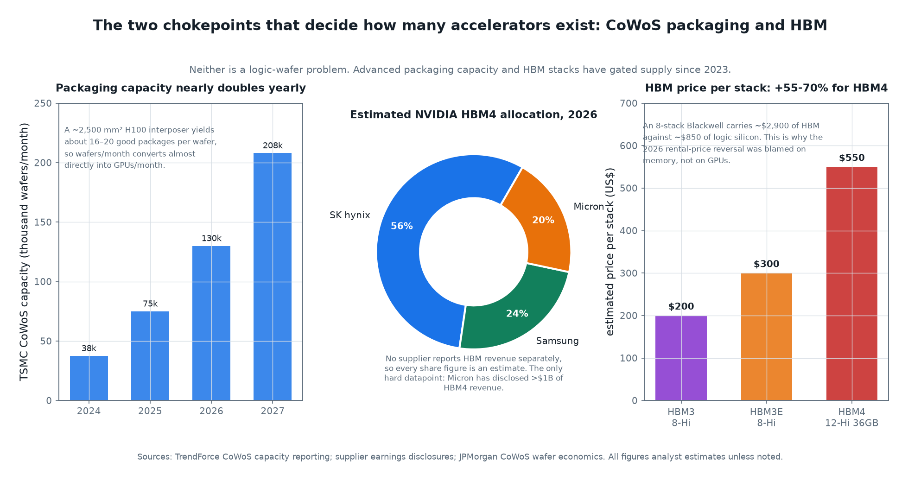

**Advanced packaging.** TSMC CoWoS capacity: ~37.5k wafers/month in 2024, ~75k in 2025, a 120–140k target for 2026, with a further >60% expansion planned for 2027 and another 50–60k from OSAT partners. Against that, annual CoWoS demand went ~370k wafers (2024) → ~670k (2025) → approaching 1M (2026). The supply-demand gap is around 20%, forecast to narrow to about 10% by end-2026. NVIDIA reportedly reserved 800–850k wafers of 2026 capacity, over half the total; a competing estimate says ~60%, with the top three customers taking >85%. CoWoS lead times were 40–52 weeks in early 2026. (estimate; the allocation figures are channel checks that disagree)

Why this gates supply: a ~2,500 mm² H100-class interposer yields roughly 16–20 good packages per 300 mm wafer at 60–70% yield, so wafers per month converts almost directly into GPUs per month. **H100 availability through 2024 was constrained by packaging, not by logic wafers.**

**HBM.** All three suppliers sold out their 2026 capacity under multi-year agreements; as one analysis puts it, the market "is not price-discovered; it is administratively allocated." All three shipped HBM4 in volume during H1 2026. The only hard public number is Micron's disclosed **>$1B of HBM4 revenue**, with 12-high HBM4 ramping twice as fast as HBM3E did. Reported segment operating margins: Micron 80.4%, SK hynix 76.3%, Samsung DS 70.0%. Share estimates disagree materially between sources (SK hynix somewhere between 50% and 70% of NVIDIA's HBM4 allocation) because **no supplier reports HBM revenue separately**. HBM4 12-Hi 36 GB stacks are estimated at $500–600 against ~$300 for HBM3E, a 55–70% increase. (confirmed where noted; shares are estimates)

**And increasingly, electricity.** A GB200 NVL72 rack is 132 kW, a GB300 about 140 kW, an AMD Helios 125–135 kW, and a TPU v7 superpod nearly 10 MW. The GB200 chassis weighs about 1.36 tonnes and does not fit through a standard datacenter door — retrofits are frequently impossible. Transformer lead times exceed 50 weeks. Stargate Abilene has 421 MW of IT load energised of a 1.2 GW design, and a 600 MW tranche was scrapped in March 2026 on financing and demand-forecast changes. Big-four 2026 capex guidance totals about **$630B, up 62%** year over year. (confirmed for capex guidance and rack power; site details are estimates)

### 10.3 What it costs to rent

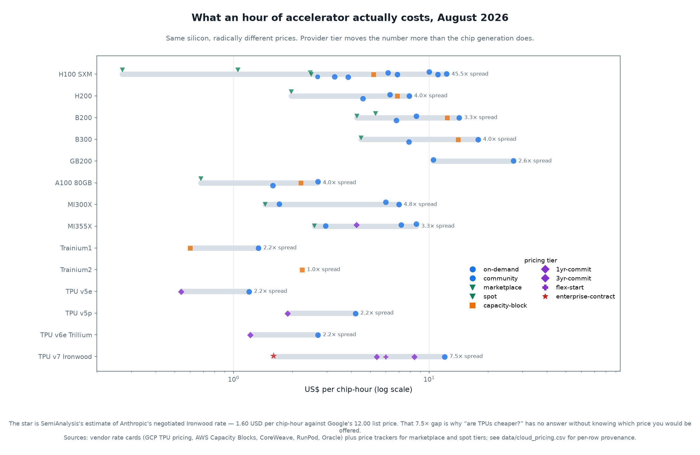

| Accelerator | Cheapest observed | Typical neocloud on-demand | Hyperscaler on-demand | Committed / reserved | Spread |
| --- | --- | --- | --- | --- | --- |
| **H100 SXM** | $0.27 | $3.29 | $10.53 | $5.19 | 45.5× |
| **H200** | $1.97 | $5.45 | $7.91 | $6.87 | 4.0× |
| **B200** | $4.26 | $6.79 | $14.24 | $12.36 | 3.3× |
| **B300** | $4.48 | $6.19 | $17.80 | $14.04 | 4.0× |
| **GB200** | $10.50 | $10.50 | $27.00 | — | 2.6× |
| **A100 80GB** | $0.68 | $2.15 | — | $2.21 | 4.0× |
| **MI300X** | $1.45 | $1.71 | $6.50 | — | 4.8× |
| **MI355X** | $2.59 | $3.60 | $8.60 | $4.25 | 3.3× |
| **Trainium1** | $0.60 | — | $1.34 | $0.60 | 2.2× |
| **Trainium2** | $2.24 | — | — | $2.24 | 1.0× |
| **TPU v5e** | $0.54 | — | $1.20 | $0.54 | 2.2× |
| **TPU v5p** | $1.89 | — | $4.20 | $1.89 | 2.2× |
| **TPU v6e Trillium** | $1.22 | — | $2.70 | $1.22 | 2.2× |
| **TPU v7 Ironwood** | $1.60 | — | $12.00 | $1.60 | 7.5× |

The dominant fact here is dispersion, not level. Identical H100 silicon spans **$0.27 (Vast.ai spot) to $12.29 (Azure on-demand)** — a 45× spread, or about 12× excluding spot. MI300X spans $1.45 to $7.86. Three structural reasons: neocloud overhead is roughly $0.20–0.50 per GPU-hour against $1.00–2.00 at hyperscalers; marketplaces expose host-set prices with no SLA; and hyperscaler list prices bundle support, networking, storage and compliance that specialists do not.

**The trend is not monotonic, and most published narratives are out of date.** H100 on-demand went from roughly $7–10/hour at the 2023 peak to $2–4 by late 2025 — driven by CoWoS capacity doubling, neocloud entry, Blackwell pushing Hopper down the stack, and depreciation pressure on unsold inventory. Then it partially reversed: **contract pricing rose about 40% between October 2025 and March 2026, attributed to HBM3e cost pass-through.** Memory, not GPU fabrication, became the binding constraint. Blackwell lead times stretched to 3–7 months by early 2026. (estimate)

### 10.4 Normalised: what you get per dollar

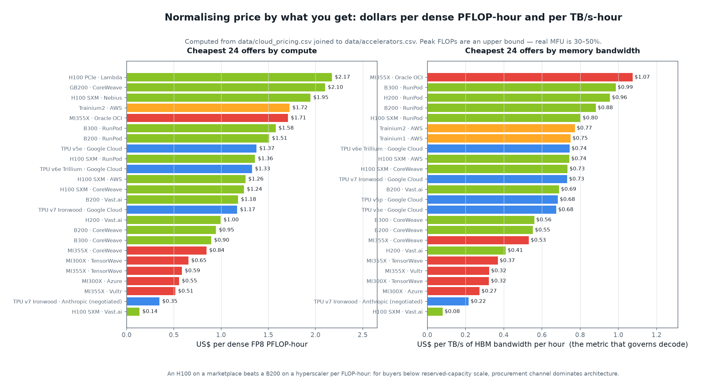

| Offer | $/chip-hour | $ per dense FP8 PFLOP-hour | $ per TB/s-hour |
| --- | --- | --- | --- |
| H100 SXM · Vast.ai (spot) | $0.27 | $0.14 | $0.08 |
| TPU v7 Ironwood · Anthropic (negotiated) (enterprise-contract) | $1.60 | $0.35 | $0.22 |
| MI355X · Vultr (spot) | $2.59 | $0.51 | $0.32 |
| H100 SXM · Vast.ai (marketplace) | $1.05 | $0.53 | $0.31 |
| MI300X · Azure (spot) | $1.45 | $0.55 | $0.27 |
| MI355X · TensorWave (on-demand) | $2.95 | $0.59 | $0.37 |
| MI300X · TensorWave (on-demand) | $1.71 | $0.65 | $0.32 |
| MI355X · CoreWeave (1yr-commit) | $4.25 | $0.84 | $0.53 |
| B300 · CoreWeave (spot) | $4.48 | $0.90 | $0.56 |
| B200 · CoreWeave (spot) | $4.26 | $0.95 | $0.55 |
| H200 · Vast.ai (marketplace) | $1.97 | $1.00 | $0.41 |
| TPU v7 Ironwood · Google Cloud (3yr-commit) | $5.40 | $1.17 | $0.73 |
| B200 · Vast.ai (marketplace) | $5.31 | $1.18 | $0.69 |
| H100 SXM · CoreWeave (spot) | $2.46 | $1.24 | $0.73 |
| H100 SXM · AWS (spot) | $2.49 | $1.26 | $0.74 |

Two conclusions survive normalisation.

**Procurement channel dominates architecture.** An H100 on a marketplace beats a B200 on a hyperscaler per dense FP8 PFLOP-hour. For any buyer below reserved-capacity scale, *where* you buy matters more than *what* you buy.

**The TPU answer depends entirely on which price you are offered.** Ironwood at the $12.00 list price is $2.60 per dense FP8 PFLOP-hour — unremarkable. At the $5.40 three-year rate it is $1.17. At SemiAnalysis's estimated Anthropic rate of $1.60 it is $0.35, the cheapest compute in the table by a factor of three. That 7.5× spread is the single largest pricing asymmetry in the industry.

For decode-bound serving, use the memory-bandwidth column instead: dollars per TB/s-hour reorders the table and is a better proxy for tokens per second per user.

### 10.5 Total cost of ownership

Published capex figures for a full AI datacenter, all estimates, and note carefully whether accelerators are included:

| Scope | $ per MW |
|---|---|
| Standard shell and core | $10.7–11.3M |
| AI-optimised shell with liquid cooling | $12–15M |
| AI facility plus tenant IT fit-out, **excluding GPUs** | $15–25M |
| **Full stack including GPUs (GB200 NVL72)** | **$30–45M** |
| Epoch AI model, US hyperscaler 1 GW GB200 build | **$38M upfront, $0.9M/yr opex, $8.5M/yr annualised TCO** |

Epoch's composition: servers ~56% of capex, facility MEP/shell/labour ~30%, network and cluster infrastructure ~13%. In *annualised* TCO, servers and GPUs are ~60% and energy only ~7% — which is why the depreciation-schedule debate matters more than the electricity bill, and why the asset's economic life is the accelerator's life, not the concrete's.

**The SemiAnalysis TPU-versus-GPU model** is the most rigorous public comparison, and every number in it is an estimate: Google's internal all-in TCO per Ironwood chip is roughly **44% below** a GB200 server; an external GCP customer sees roughly **30% below GB200 and 41% below GB300** per hour; and for Anthropic, assuming 40% MFU on TPU against 30% on GB300, cost per effective PFLOP is about **52% lower**, with a break-even MFU of 19%. The structural explanation is not that Broadcom's silicon is cheap — Google pays Broadcom a healthy margin — but that it is far less than the margin NVIDIA earns across the *whole system*: GPU, CPU, switch, NIC, memory, cabling and rack.

### 10.6 Export controls, as of August 2026

The policy environment is now a first-order determinant of who can buy what, and it has moved repeatedly.

| Date | Action |
|---|---|
| Oct 2022 | Initial BIS rule; A100/H100 restricted to China |
| Oct 2023 | Expanded; A800/H800 workaround parts also restricted |
| Dec 2024 | HBM and semiconductor equipment controls added |
| Jan 2025 | AI Diffusion Rule published — **rescinded 13 May 2025 before taking effect** |
| Apr 2025 | H20 licence requirement → NVIDIA takes a **$4.5B charge** |
| Aug 2025 | H20 and MI308 licences granted conditioned on a **15% revenue share** to the US government |
| Dec 2025 | H200 sales to China announced as permitted at **25%** |
| **13 Jan 2026** | BIS rule permitting case-by-case licences up to H200 / MI325X performance |
| **14 Jan 2026** | Presidential proclamation: **25% import tariff** on H200 and MI325X — the only two chips under both the rule and the tariff |
| May 2026 | ~10 Chinese firms cleared with a **75,000-unit cap each**; zero deliveries at that point |
| May 2026 | BIS extends licensing to China/Macau-headquartered entities **wherever they operate** |
| Aug 2026 | First H200 deliveries reach ByteDance and Tencent — roughly **10,000 units each, routed to Hong Kong**, outside the mainland customs border, on Beijing's instruction to protect domestic chipmakers |

(all confirmed from rule text, proclamations and company filings, except delivery volumes which are press-reported)

Two numbers frame the gap between policy and practice. The rule's 50% provision implies a ceiling somewhere around **817,000 to 900,000 H200-equivalents**; Chinese demand is estimated at about 2 million H200s. And NVIDIA's own guidance is unambiguous: as of 20 May 2026 it had "yet to generate any revenue" from H200 China licences and assumes **no China datacenter compute revenue** in guidance. The policy ceiling and the actual flow differ by roughly 50×.

For context on the alternative: Huawei's 2026 Ascend 910C production target is about 600,000 chips (up from ~200,000 in 2025) against Chinese demand of 1.0–1.5 million, constrained by SMIC 7nm yield and domestic HBM.

### 10.7 The money, confirmed

Because so much of this section is estimated, it is worth grounding in filings. NVIDIA's quarter ended 26 April 2026: **$81.6B total revenue (+85% YoY), $75.2B data center (+92%), of which $60.4B compute and $14.8B networking (+199%), at 74.9% GAAP gross margin.** Supply commitments rose to **$145B**. Management states "$1 trillion in Blackwell and Rubin revenue we foresee from 2025 through calendar 2027" and, on Rubin, "my sense is that we will be supply constrained throughout the entire life of Vera Rubin."

Broadcom, the TPU co-designer: Q2 FY26 AI semiconductor revenue **$10.8B (+143%)** against **>$30B of AI bookings**, guiding **$56B for FY2026** and **>$100B for FY2027**, with a Google supply assurance agreement running through 2031. Marvell's custom XPU revenue doubled to $1.5B in FY26. Amazon's chips business is at a **>$25B run rate**. (all confirmed)

That is the shape of the market: custom silicon is unambiguously real and growing faster in percentage terms, while NVIDIA still captures most of the dollars because it sells the CPU, the switch, the NIC and the rack alongside the accelerator.

---

## 11. Choosing hardware

A decision procedure, in the order the questions actually bind.

### 11.1 Start with the constraint, not the chip

**1. Does your model fit, and how much sharding does that force?** Model state is 16 bytes per parameter. Add activations and KV cache. If ZeRO-1 data parallelism alone fits, take it — Zyphra's ZAYA1 shows that high-capacity HBM buys away entire parallelism axes, and every axis you avoid is a class of bugs and a source of communication you do not pay for. This is the strongest argument for MI300X/MI355X/MI455X and for TPU v7 over an 80 GB H100.

**2. How large a scale-up domain does your parallelism need?** If tensor parallelism above 8 or MoE expert parallelism is on the critical path, an 8-GPU HGX node will cost you dearly and a 72-chip NVL72/Helios or a TPU pod will not. The worked example in §4.4 is the whole argument: the same tensor-parallel all-reduce is 8.5% of layer time on NVLink 4 and 76% on 400G InfiniBand.

**3. Is your workload prefill/training-shaped or decode-shaped?** Training and prefill are compute-bound above ~300 FLOP/byte; decode is memory-bandwidth-bound below batch ~300 and will not be rescued by more FLOPS. Price decode capacity in dollars per TB/s-hour, not dollars per PFLOP-hour.

**4. What is your software risk tolerance?** If you write custom fused kernels for novel architectures, CUDA remains the only place where everything lands first. If you run mainstream dense or MoE transformers with PyTorch, vLLM or JAX, the alternatives work today.

**5. What price can you actually get?** This is the question most analyses skip, and it usually dominates. See §10.3.

### 11.2 A rough mapping

| Situation | Reasonable choice | Reasoning |
|---|---|---|
| Frontier pretraining, thousands of chips, need the best software | GB300 NVL72 → Vera Rubin NVL72 | Largest audited results, 72-chip domain, NVFP4 recipes, breadth of tooling |
| Frontier pretraining, willing to co-design and commit for years | TPU v7 / 8t pods, or Trainium3 | Best TCO *if* you can negotiate; determinism and OCS fault tolerance at 9k+ chips |
| Large-scale inference serving, cost per token dominates | TPU 8i, MTIA 400, Maia 200, MI355X | Memory capacity and bandwidth per dollar; low kernel diversity makes non-CUDA viable |
| MoE training, hundreds to low thousands of chips | GB300/GB200 NVL72 | All-to-all inside one rack; see the CoreWeave scaling ladder in §9.3 |
| Fine-tuning and mid-size training on rented capacity | H100/H200 from a neocloud or marketplace | Cheapest dollars per PFLOP-hour anywhere; H200's 141 GB removes a sharding tier |
| Memory-hungry inference, single node | MI355X (288 GB) or MI300X (192 GB) | Fits models that need 2–3 H100s on one GPU; ROCm is fine for vLLM/SGLang |
| Latency-critical serving, tokens/sec/user is the product | Cerebras CS-4, Groq/NVIDIA LPX | SRAM-only bandwidth; not the cheapest per token above ~8 concurrent requests |
| Cost-constrained enterprise inference, air-cooled racks | Gaudi 3, Intel Crescent Island, L40S | Published prices, no liquid cooling, no HBM supply exposure |
| Research on a workstation | RTX 5090 (32 GB, FP4) or RTX PRO 6000 (96 GB) | No NVLink means single-GPU work only |
| Learning the stack, minimal budget | Tenstorrent Blackhole p150a at $1,399 | Open RISC-V stack; accept the software gap and 512 GB/s |
| Inside China | Ascend 910C now, 950DT when it ships | Export controls make this the only supply that reliably arrives |

### 11.3 Five mistakes this report exists to prevent

**Comparing sparse to dense.** Vendor headline TFLOPS are usually 2:1 sparse. Halve them. Meta has confirmed publicly that sparsity is not used in its production models because of quality loss; assume the same everywhere unless proven otherwise.

**Comparing peak FLOPS at all.** Well-tuned dense pretraining is 40–50% MFU; decode at batch 32 is capped near 11%. A 2× peak advantage frequently delivers 1.2× in production, and sometimes nothing at all if the bottleneck is bandwidth or the fabric.

**Comparing chips when the product is a rack.** A GB200 NVL72 is not nine HGX nodes; the 72-GPU coherent domain changes which parallelism strategies are viable. Conversely, a TPU superpod is 9,216 chips, so pod-level totals are not comparable to a rack.

**Treating a vendor's TCO advantage as your TCO advantage.** SemiAnalysis's 44% figure for Ironwood is Google's internal cost of goods. You rent at a price Google sets and cannot take the silicon elsewhere. Convert every TCO claim into a quote before believing it.

**Assuming benchmark leadership transfers.** MLPerf has no perf/$ or perf/W metric, submitters choose their scale, rounds are six months apart, and Ironwood has never been submitted. The most-discussed matchup of 2026 — Ironwood versus Blackwell Ultra — has zero audited data behind it.

### 11.4 What to watch next

- **HBM4 supply and pricing.** It is the reason rental prices rose in H1 2026. If 2027 capacity lands on schedule, that reverses; if not, GPU prices keep climbing even as packaging capacity improves.
- **Whether FP4 training becomes standard.** NVFP4 has produced a 10T-token, 12B-parameter run within ~1.5% of FP8 loss. If that holds at frontier scale, effective compute per rack roughly doubles again without new silicon — and the MXFP4-versus-NVFP4 token penalty becomes a real competitive asymmetry.
- **Whether Google sells TPUs externally.** Morgan Stanley's 5M-unit 2027 forecast and persistent Meta reports point that way. It would be the single biggest structural change to the market since Hopper. Currently a rumor.
- **Scale-up domain inflation.** 72 today, 144 on Trainium3, 1,152–9,600 on TPU 8i/8t, 6,144 on Maia 200. If NVIDIA's 576-GPU NVLink ceiling gets used, tensor and expert parallelism get much cheaper and the parallelism playbook changes again.
- **Ethernet versus proprietary fabric for scale-up.** AMD (UALink-over-Ethernet), Intel (RoCE on-die), Microsoft (Ethernet plus a custom transport) and Meta have all chosen Ethernet. CoreWeave's MLPerf record on Spectrum-X shows it works at 8,192 GPUs.
- **Power, not silicon.** Growth in training compute comes 1.69× per year from more chips and 1.53× from longer runs against only 1.41× from faster chips. Gigawatt campuses, transformer lead times and grid interconnection queues are the real 2027 constraint.

---

## 12. Appendix: methodology, conflicts and unknowns

### 12.1 How this report was built

```
data/                        seven CSVs, every row carrying a confidence label
  accelerators.csv           49 accelerators: specs, TDP, fabric, price
  cloud_pricing.csv          59 offers across 12 providers and 9 pricing tiers
  rack_systems.csv           12 rack- and pod-scale systems
  mlperf_training.csv        MLPerf Training v4.0 through v6.0 results
  training_runs.csv          published training compute for 14 real models
  bom_costs.csv              modelled bill of materials for 6 chips
  supply_chain.csv           CoWoS capacity, HBM share and price, volumes, rack power
  llama3_failures.csv        Meta's 419-interruption failure log

scripts/
  theme.py                   shared style, vendor palette, drawing helpers
  fig_diagrams.py            8 architecture diagrams drawn from primitives
  fig_data.py                16 plots computed from the CSVs
  tables.py                  markdown tables generated from the CSVs
  build_site.py              assembles report.md and the HTML site

report/report.md             the single-file report
report/figures/              24 generated PNGs
docs/index.html              the HTML version
```

Reproduce everything with `python3 scripts/build_site.py --figures`.

Where the report states a derived number — job MTBF, checkpoint waste, dollars per PFLOP-hour, the tensor-parallel communication example — it is computed in code from labelled inputs, and the inputs are cited. Nothing is interpolated silently: unpublished values are blank in the CSVs and render as em-dashes in the tables.

### 12.2 Conflicting numbers you will encounter

These are the disagreements most likely to bite anyone doing capacity or cost math.

| Item | The conflict | What this report uses |
|---|---|---|
| H100 SXM bandwidth | Hopper whitepaper says 3.0 TB/s and marks it "not finalized"; product page says 3.35 | **3.35 TB/s** |
| B200 memory | 192 GB (keynote, raw HBM) vs 186 GB (GB200 datasheet) vs 180 GB (HGX datasheet) | 186 / 180 GB, with 192 noted |
| B300 memory | 288 GB (keynote) vs 279 / 270 GB (Oct 2025 datasheet, corroborated by Lambda's MLPerf entry) | **279 GB** |
| Blackwell Ultra INT8 | 330 TOPS sparse where B200 lists 10 POPS — a ~30× cut, internally consistent but unexplained | as published, flagged |
| Blackwell Ultra FP64 | 1.3 TFLOP/s vs B200's 40 — a deliberate 30× cut | as published |
| B200 SM count and L2 | NVIDIA publishes neither; 148 SMs and 126 MB are Chips and Cheese measurements | measured values, labelled |
| Rubin NVFP4 | "50 PFLOPS inference / 35 PFLOPS training" is not a 2× relationship and NVIDIA has not explained the basis | as published, flagged |
| Rubin naming | "NVL144" (die count) vs shipping "NVL72" (package count) | **NVL72** |
| Rubin fabric | 260 TB/s in-rack NVLink vs 28.8 TB/s rack-to-rack scale-out, frequently conflated | both, labelled separately |
| MI455X bandwidth | 23.3 TB/s per GPU / 1.7 PB/s per rack (AMD) vs 19.6 / 1.4 (Supermicro) | 23.3, with 19.6 noted |
| MI355X platform FP8 | AMD's platform table lists 80.5 PFLOPS where 8 × 5.03 = 40.3 | per-GPU figures |
| GH200 HBM3e | 144 GB / 4.9 TB/s (NVIDIA) vs 141 / 4.8 (secondary, likely conflated with H200) | **144 GB / 4.9 TB/s** |
| TPU v2 peak | 46 BF16 TFLOP/s (ISCA 2021) vs 45 or 43 in marketing | **46** |
| TPU v4 power | Paper: 121 W min / 170 mean / 192 max, idle 90; Cloud docs list 90 as minimum | paper values |
| GB300 NVL72 price | $3.7–4.0M (Loop Capital) vs $6.0–6.5M (Tom's Hardware supply chain) | $3.7M, flagged |
| TPU 2026 volume | 2.7M (SemiAnalysis, Aug 2026, revised down) to 4.6M (BofA) | **2.7M**, flagged |
| Ascend 910C specs | Huawei's own paper v1 gives throughput; v2 deleted it and v3 renamed the part | v1, pinned |
| MTIA 450/500 compute | Published FP8 figures contradict Meta's own 25× scaling claim | unresolved, flagged |
| TPU 8i pod compute | Reported 331.8 EFLOPS does not reconcile with chip count or the stated multiple | unresolved, flagged |
| Cerebras "125 PFLOPS" | Sparse FP16 with unstructured sparsity; no dense equivalent published | not compared to dense |
| MFU expectations | Lambda's own whitepaper says 35–45%; a third party reads Lambda's benchmarks as 60–68% | **35–50%** for dense pretraining |
| Colossus GPU count | 200,000 (x.ai) vs ~230,000 itemised vs ">220,000" (Anthropic lease) vs 276k H100-equivalents (Epoch) | all cited, by convention |

### 12.3 Things nobody has published

Stated explicitly, because their absence shapes every comparison:

- **B200/B300 official SM, CUDA core and Tensor Core counts.** NVIDIA stopped publishing these for datacenter parts.
- **B300 L2 size and die size. Rubin's CUDA core count, die size, L2 size, TDP and price.** Rubin's process node comes only from third parties.
- **Per-chip TDP, clock speed and process node for every TPU after v4.** Google's ~1 kW Ironwood figure here is inferred from pod power.
- **Any Ironwood MLPerf result.** None exists.
- **Trainium3 public pricing.** Capacity Blocks and enterprise agreements only.
- **AMD's dense-versus-sparse labelling for MI455X**, and its process node.
- **H20's SM count, transistor count and die configuration.** No NVIDIA datasheet exists.
- **Per-part cost of goods from any vendor.** Every BOM figure in §10.1 is modelled.
- **HBM revenue by supplier.** No share figure is verifiable.
- **Gemini 1.5/2.5/3 training compute; Nemotron total FLOPs.** Not disclosed.
- **The percentage of step time spent in communication at frontier scale.** No lab publishes it; §4.4's figures are derived.

### 12.4 Primary sources

**Architecture.** NVIDIA Volta, Ampere, Hopper, Ada and RTX Blackwell architecture whitepapers; NVIDIA Blackwell, Blackwell Ultra and GH200 datasheets; NVIDIA Rubin architecture blog; Chips and Cheese B200 microarchitectural analysis; Jouppi et al., *In-Datacenter Performance Analysis of a TPU* (ISCA 2017), *Ten Lessons From Three Generations Shaped Google's TPUv4i* (ISCA 2021), and *TPU v4: An Optically Reconfigurable Supercomputer* (ISCA 2023); Google Cloud TPU architecture documentation; Ironwood Hot Chips 2025 deck; Google Cloud eighth-generation TPU deep dive; AMD MI350/MI355X product briefs and Helios launch materials; Intel Gaudi 3 whitepaper and Hot Chips 2024 deck; AWS Neuron architecture documentation; Meta MTIA ISCA 2025 paper; Microsoft Maia 100 Hot Chips 2024 deck and Maia 200 announcement; Cerebras WSE-3 datasheet; Groq LPU documentation; SambaNova SN40L ISSCC 2025 paper; Tenstorrent Blackhole specifications.

**LLM systems.** Kaplan et al. 2020 (arXiv:2001.08361); Hoffmann et al. 2022 (arXiv:2203.15556); Rajbhandari et al., ZeRO (arXiv:1910.02054); Shoeybi et al., Megatron-LM (arXiv:1909.08053); Narayanan et al. 2021 (arXiv:2104.04473); Korthikanti et al. 2022 (arXiv:2205.05198); Dao et al., FlashAttention (arXiv:2205.14135) and FlashAttention-3 (arXiv:2407.08608); Grattafiori et al., *The Llama 3 Herd of Models* (arXiv:2407.21783); DeepSeek-V3 technical report (arXiv:2412.19437) and hardware paper (arXiv:2505.09343); Anthony et al., ZAYA1 (arXiv:2511.17127); NVIDIA, *Pretraining LLMs with NVFP4* (arXiv:2509.25149); OCP Microscaling Formats v1.0; Gemini technical reports (arXiv:2312.11805, arXiv:2403.05530); PaLM (JMLR 24:240); Apple Intelligence Foundation Language Models.

**Benchmarks and market data.** MLCommons MLPerf Training v4.0, v4.1, v5.0, v5.1 and v6.0 result sets and submitter write-ups; Google Cloud TPU pricing page; AWS EC2 Capacity Blocks pricing; CoreWeave, RunPod and Oracle price lists; NVIDIA, Broadcom, Marvell, Micron and Amazon earnings materials; TrendForce CoWoS reporting; Epoch AI training-compute datasets and datacenter directory; SemiAnalysis TPU and TCO analyses; BIS rule text and the January 2026 presidential proclamation.

### 12.5 Correcting this report

The datasets are the interface. To change a number, edit the CSV row — the confidence column is required — and re-run `python3 scripts/build_site.py --figures`. Every table and figure that depends on it updates, so the prose and the plots cannot drift apart. Where a value is disputed, the convention used here is to record the better-sourced value in the CSV and note the conflict in §12.2 rather than silently averaging.
